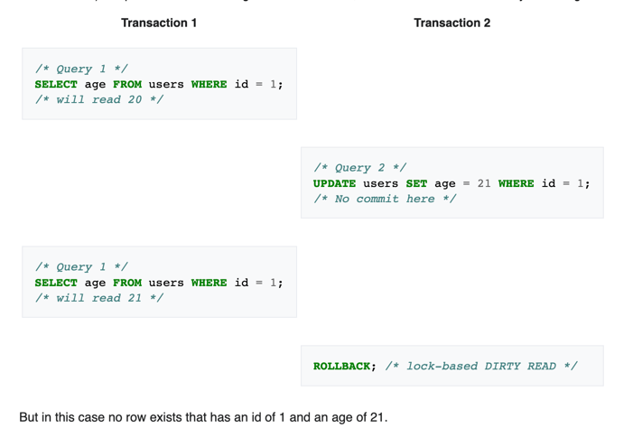
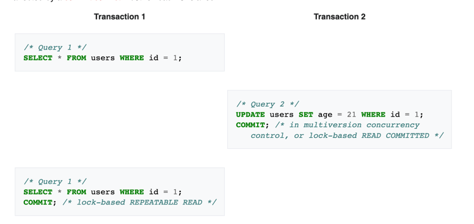
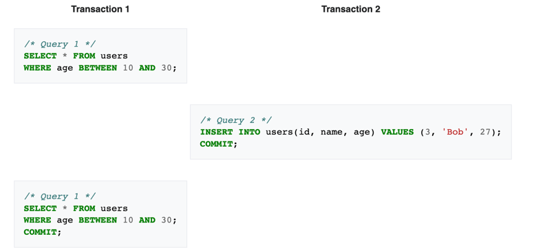

# Python Questions for Senior and Lead roles


- [Python Questions for Senior and Lead roles](#python-questions-for-senior-and-lead-roles)
  * [Mutable and Immutable Objects](#mutable-and-immutable-objects)
    + [Mutable objects (call by reference)](#mutable-objects-call-by-reference)
    + [Immutable objects (pass by value)](#immutable-objects-pass-by-value)
    + [Features](#features)
    + [How objects are passed to Functions](#how-objects-are-passed-to-functions)
  * [Ways to execute Python code: exec, eval, ast, code, codeop, etc.](#ways-to-execute-python-code-exec-eval-ast-code-codeop-etc)
  * [Advanced differences between 2.x and 3.x in general](#advanced-differences--between-2x-and-3x-in-general)
    + [Division operator](#division-operator)
    + [`print` function](#print-function)
    + [Unicode](#unicode)
    + [`xrange`](#xrange)
    + [Error Handling](#error-handling)
    + [`_future_` module](#_future_-module)
    + [Six](#six)
  * [`deepcopy`, method `copy`, slicing, etc.](#deepcopy-method-copy-slicing-etc)
  * [OrderedDict, DefaultDict](#ordereddict-defaultdict)
  * [`hashable()`](#hashable)
  * [Strong and weak typing](#strong-and-weak-typing)
  * [Frozenset](#frozenset)
  * [Weak references](#weak-references)
  * [Raw strings](#raw-strings)
  * [Unicode and ASCII strings](#unicode-and-ascii-strings)
- [Python Statements and Syntax](#python-statements-and-syntax)
  * [Iteration protocol.](#iteration-protocol)
  * [Generators](#generators)
  * [yield](#yield)
  * [method send(), throw(), next(), close()](#method-send-throw-next-close)
  * [Coroutines](#coroutines)
- [Functions in Python](#functions-in-python)
  * [When and how many times are default arguments evaluated?](#when-and-how-many-times-are-default-arguments-evaluated)
  * [`partial`](#partial)
  * [Best practice decorators for functions](#best-practice-decorators-for-functions)
  * [Decorator](#decorator)
  * [Decorator factory (passing args to decorators)](#decorator-factory-passing-args-to-decorators)
  * [`wraps`](#wraps)
  * [Decorator for class](#decorator-for-class)
  * [Indirect function calls](#indirect-function-calls)
  * [Function introspection](#function-introspection)
  * [Implementation details of functional programming, for vs map](#implementation-details-of-functional-programming-for-vs-map)
- [Scopes in Python](#scopes-in-python)
  * [LEGB rule](#legb-rule)
  * [`global` and `nonlocal`](#global-and-nonlocal)
    + [The `global` Statement](#the-global-statement)
    + [The `nonlocal` Statement](#the-nonlocal-statement)
  * [Scopes and nested functions, closures](#scopes-and-nested-functions-closures)
  * [globals() и locals(): Meaning, could we change both of them?](#globals-%D0%B8-locals-meaning-could-we-change-both-of-them)
- [Modules in Python](#modules-in-python)
  * [Module `reload`, `importlib`](#module-reload-importlib)
- [OOP in Python](#oop-in-python)
  * [SOLID](#solid)
  * [The four basics of object-oriented programming](#the-four-basics-of-object-oriented-programming)
  * [abstract base class](#abstract-base-class)
  * [getattr(), setattr()](#getattr-setattr)
  * [`__getattr__`, `__setattr__`, `__delattr__`](#__getattr__-__setattr__-__delattr__)
  * [`__getattribute__`](#__getattribute__)
  * [Name mangling](#name-mangling)
  * [@property(getter, setter, deleter)](#propertygetter-setter-deleter)
  * [init, repr, str, cmp, new , del, hash, nonzero, unicode, class operators](#init--repr-str-cmp--new--del--hash-nonzero-unicode-class-operators)
  * [Rich comparison methods](#rich-comparison-methods)
  * [`__call__`](#__call__)
  * [Multiple inheritance](#multiple-inheritance)
  * [Classic algorithm](#classic-algorithm)
  * [Diamond problem](#diamond-problem)
  * [MRO, super](#mro-super)
  * [Mixins](#mixins)
  * [metaclass definition](#metaclass-definition)
  * [type(), isinstance(), issubclass()](#type-isinstance-issubclass)
    + [`type()` Return Value](#type-return-value)
  * [`__slots__`](#__slots__)
- [Troubleshooting in Python](#troubleshooting-in-python)
  * [Types of profilers: Static and dynamic profilers](#types-of-profilers-static-and-dynamic-profilers)
    + [`trace` module](#trace-module)
    + [`faulthandler` module](#faulthandler-module)
    + [application performance monitoring (APM) tools that fit](#application-performance-monitoring-apm-tools-that-fit)
    + [What part of the code should I profile?](#what-part-of-the-code-should-i-profile)
    + [Typically, we profile:](#typically-we-profile)
    + [What metrics should I profile?](#what-metrics-should-i-profile)
    + [Memory profiling](#memory-profiling)
    + [Deterministic profiling versus statistical profiling](#deterministic-profiling-versus-statistical-profiling)
    + [`pyinstrument`](#pyinstrument)
  * [`resource` module](#resource-module)
  * [context managers contextlib decorator, with-enabled class](#context-managers-contextlib-decorator-with-enabled-class)
- [Unit testing in Python](#unit-testing-in-python)
  * [Mock objects](#mock-objects)
  * [Coverage](#coverage)
  * [nosetests, doctests](#nosetests-doctests)
- [Memory management in Python](#memory-management-in-python)
  * [3 generations of GC](#3-generations-of-gc)
    + [module gc](#module-gc)
    + [Which type of objects are tracked?](#which-type-of-objects-are-tracked)
  * [recommendations for GC usage](#recommendations-for-gc-usage)
  * [Memory leaks/deleters issues](#memory-leaksdeleters-issues)
- [Threading and multiprocessing in Python](#threading-and-multiprocessing-in-python)
  * [GIL (Definition, algorithms in 2.x and 3.x)](#gil-definition-algorithms-in-2x-and-3x)
  * [Threads(modules thread, threading; class Queue; locks)](#threadsmodules-thread-threading-class-queue-locks)
  * [Processes(multiprocessing, Process, Queue, Pipe, Value, Array, Pool, Manager)](#processesmultiprocessing-process-queue-pipe-value-array-pool-manager)
  * [How to avoid GIL restrictions (C extensions)](#how-to-avoid-gil-restrictions-c-extensions)
- [Distributing and documentation in Python](#distributing-and-documentation-in-python)
  * [`distutils`, setup.py](#distutils-setuppy)
  * [code publishing](#code-publishing)
  * [Documentation autogeneration: sphinx, pydoc, etc.](#documentation-autogeneration-sphinx-pydoc-etc)
- [Python and C interaction](#python-and-c-interaction)
  * [C ext API,call C from python, call python from C](#c-ext-apicall-c-from-python-call-python-from-c)
  * [cffi, swig, SIP, boost-python](#cffi-swig-sip-boost-python)
    + [Boost](#boost)
- [Python tools](#python-tools)
  * [Python standard library](#python-standard-library)
  * [Advanced knowledge of standard library:](#advanced-knowledge-of-standard-library)
- [Code Standards](#code-standards)
  * [Knows how to design and implement Code Standards (PEP8)](#knows-how-to-design-and-implement-code-standards-pep8)
- [Code Review Process](#code-review-process)
  * [Explains Pros and Cons of Pre- and Post-commit Code Reviews](#explains-pros-and-cons-of-pre--and-post-commit-code-reviews)
- [Release Strategy](#release-strategy)
  * [Centralized (Trunk Based) approach](#centralized-trunk-based-approach)
  * [GitFlow approach](#gitflow-approach)
  * ["Infrastructure as a Code" concept - Ansible / Ansible Tower](#infrastructure-as-a-code-concept---ansible--ansible-tower)
  * [Dependency Management approaches](#dependency-management-approaches)
  * [NuGet, Artifactory and Nexus](#nuget-artifactory-and-nexus)
  * [Branching strategy](#branching-strategy)
    + [Git Flow](#git-flow)
    + [GitHub Flow](#github-flow)
    + [Trunk Based Development (TBD)](#trunk-based-development-tbd)
    + [GitLab Flow](#gitlab-flow)
  * [Continuous Integration](#continuous-integration)
  * [Continuous Delivery & Deployment](#continuous-delivery--deployment)
- [Unit and API Testing (White box)](#unit-and-api-testing-white-box)
  * [Test coverage. Understand how to treat this metric](#test-coverage-understand-how-to-treat-this-metric)
  * [TDD and BDD approaches (Implements TDD and BDD from scratch)](#tdd-and-bdd-approaches-implements-tdd-and-bdd-from-scratch)
  * [Mutation testing, tools](#mutation-testing-tools)
- [Logging](#logging)
  * [Health Check](#health-check)
  * [Main approaches for monitoring and Troubleshooting](#main-approaches-for-monitoring-and-troubleshooting)
- [Skills](#skills)
  * [Leadership](#leadership)
  * [Planning and Organizing](#planning-and-organizing)
  * [Delegation](#delegation)
  * [Control](#control)
  * [Coordination](#coordination)
- [Cross-discipline questions:](#cross-discipline-questions)
  * [Design patterns Cheetsheet](#design-patterns-cheetsheet)
    + [Behavioral (green) Cheetsheet](#behavioral-green-cheetsheet)
    + [Structural (orange) and Creational (blue) Cheetsheet](#structural-orange-and-creational-blue-cheetsheet)
  * [Creational Design Patterns](#creational-design-patterns)
    + [Factory Method - Common interface](#factory-method---common-interface)
    + [Abstract Factory - Furniture -> Antique, Modern ...](#abstract-factory---furniture---antique-modern-)
    + [Builder - Pizza making actions](#builder---pizza-making-actions)
    + [Prototype - Copey and Deepcopy](#prototype---copey-and-deepcopy)
    + [Singleton - DB connection](#singleton---db-connection)
  * [Structural Design Patterns](#structural-design-patterns)
    + [Adapter - XML -> JSON](#adapter---xml---json)
    + [Bridge - Different shapes can have different colors](#bridge---different-shapes-can-have-different-colors)
    + [Composite - Tree Structure (Folder/Element)](#composite---tree-structure-folderelement)
    + [Decorator - Additional features for object](#decorator---additional-features-for-object)
    + [Facade - Simple interface for video converter](#facade---simple-interface-for-video-converter)
    + [Flyweight - Bullet in games = Particle + Current Position](#flyweight---bullet-in-games--particle--current-position)
    + [Proxy - Do not invoke heavy object while you can](#proxy---do-not-invoke-heavy-object-while-you-can)
  * [Behavioral Design Patterns](#behavioral-design-patterns)
    + [Chain of Responsibility - Support Levels](#chain-of-responsibility---support-levels)
    + [Command - Save command in various place of interface](#command---save-command-in-various-place-of-interface)
    + [Iterator (iter, next)](#iterator-iter-next)
    + [Mediator - Aeroport dispatcher](#mediator---aeroport-dispatcher)
    + [Memento - Undo operation (Ctrl+Z)](#memento---undo-operation-ctrlz)
    + [Observer - Publisher + Subscriber](#observer---publisher--subscriber)
      - [State - Draft -> Published](#state---draft---published)
    + [Strategy - Navigator -> Drive or Walk](#strategy---navigator---drive-or-walk)
    + [Template Method](#template-method)
    + [Visitor (Looks like Mixin)](#visitor-looks-like-mixin)
  * [CAP](#cap)
    + [Availability](#availability)
    + [Consistency](#consistency)
    + [Partition tolerance](#partition-tolerance)
  * [The CAP theorem](#the-cap-theorem)
  * [Code quality metrics](#code-quality-metrics)
    + [Qualitative Code Quality Metrics](#qualitative-code-quality-metrics)
    + [Quantitative Code Quality Metrics](#quantitative-code-quality-metrics)
  * [Multiprocessing vs Multithreading vs asyncio](#multiprocessing-vs-multithreading-vs-asyncio)
  * [Mmap](#mmap)
  * [ORM - activerecord](#orm---activerecord)
  * [Django middleware](#django-middleware)
  * [Testing, mocks, runner](#testing-mocks-runner)
  * [Test coverage: branch coverage](#test-coverage-branch-coverage)
  * [Test types: performance, penetration, functional, smoke, е2е.](#test-types-performance-penetration-functional-smoke-%D0%B52%D0%B5)
  * [Semantic versioning](#semantic-versioning)
  * [API Richardson Maturity Model](#api-richardson-maturity-model)
  * [Api version](#api-version)
  * [Blue-Green deployment](#blue-green-deployment)
  * [What sort algorithms do you know? At least couple with their tradeoffs](#what-sort-algorithms-do-you-know-at-least-couple-with-their-tradeoffs)
  * [What algorithm is used in Python built-in sort function?](#what-algorithm-is-used-in-python-built-in-sort-function)
  * [If you created 5 forks of the same 10 mb memory process, how much memory would it require?](#if-you-created-5-forks-of-the-same-10-mb-memory-process-how-much-memory-would-it-require)
  * [How does dict work and explain the data structure?](#how-does-dict-work-and-explain-the-data-structure)
  * [Hash tables](#hash-tables)
  * [Ideas on cutting memory consumption of python code](#ideas-on-cutting-memory-consumption-of-python-code)
  * [Difference between docker and VMs](#difference-between-docker-and-vms)
  * [Extreme programming](#extreme-programming)
- [PostgreSQL Questions](#postgresql-questions)
  * [What is a non-clustered index?](#what-is-a-non-clustered-index)
  * [Can you store binary data in PostgreSQL?](#can-you-store-binary-data-in-postgresql)
  * [Explain functions in PostgreSQL](#explain-functions-in-postgresql)
  * [How can we change the column data type in SQL?](#how-can-we-change-the-column-data-type-in-sql)
  * [Explain Write-Ahead Logging](#explain-write-ahead-logging)
  * [What is multi-version concurrency control in PostgreSQL?](#what-is-multi-version-concurrency-control-in-postgresql)
  * [What do you understand by a partitioned table in PostgreSQL?](#what-do-you-understand-by-a-partitioned-table-in-postgresql)
  * [What are the Indices of PostgreSQL?](#what-are-the-indices-of-postgresql)
  * [What is the use of indexes in PostgreSQL?](#what-is-the-use-of-indexes-in-postgresql)
  * [What do we call database callback functions? What is its purpose?](#what-do-we-call-database-callback-functions-what-is-its-purpose)
  * [What does a Cluster index do?](#what-does-a-cluster-index-do)
  * [What are the different properties of a transaction in PostgreSQL?](#what-are-the-different-properties-of-a-transaction-in-postgresql)
  * [Which commands are used to control transactions in PostgreSQL?](#which-commands-are-used-to-control-transactions-in-postgresql)
  * [The Write-Ahead Logging](#the-write-ahead-logging)
  * [What are the three phenomena that must be prevented between concurrent transactions in PostgreSQL?](#what-are-the-three-phenomena-that-must-be-prevented-between-concurrent-transactions-in-postgresql)
- [Common Questions](#common-questions)
  * [Soft-Skills](#soft-skills)
  * [Management Questions](#management-questions)
  * [Planning Questions](#planning-questions)
  * [Leadership Questions](#leadership-questions)
  * [Delegating Questions](#delegating-questions)
  * [Control Questions](#control-questions)
  * [Mentoring Questions](#mentoring-questions)
  * [Software developing process](#software-developing-process)
  * [Estimations](#estimations)
  * [Software Developing Methodologies](#software-developing-methodologies)
  * [Scrum](#scrum)
  * [Code Review](#code-review)

## Mutable and Immutable Objects

### Mutable objects :
## Mutable objects call by reference - it means that if mutable object pass as an argument to the function, object's reference will be passed instead of value, because value of mutable object can be changed.
- list, dict, set, byte array https://docs.python.org/3/library/stdtypes.html#bytearray

### Immutable objects :
## Mutable objects call by value - it means that if immutable object pass as an argument to the function, object's value will be passed, because value of immutable object can't be changed.
- int, float, complex, string

- tuple (the “value” of an immutable object can’t change, but it’s constituent objects can) 
For example:
```python
a = ('abc', [1,2,3])
```
https://stackoverflow.com/questions/46946138/in-python-class-object-is-immutable-object-but-it-can-be-modify-why

That's why dictionary can't be created for tuple with unhashable value if tuple consists it
```python
a = ('abc', [1,2,3])
b = {a:'Hi'} # TypeError: unhashable type: 'list'
c = ('abc', 1, 2)
d = {c:'Hello'} # It will work
```
- frozen set [note: immutable version of set] 

- bytes

### Features:

Python handles mutable and immutable objects differently:
- Immutable are quicker to access than mutable objects.
- Mutable objects are great to use when you need to change the size of the object, example list, dict etc. Immutables are used when you need to ensure that the object you made will always stay the same.
- Immutable objects are fundamentally expensive to “change”, because doing so involves creating a copy. Changing mutable objects is cheap.

### How objects are passed to Functions

Its important for us to know difference between mutable and immutable types and how they are treated when passed onto functions. Memory efficiency is highly affected when the proper objects are used.

For example if a mutable object is called by reference in a function, it can change the original variable itself. 

```python
a = [1, 2, 3]

def func(input_list):
    input_list[2] = 11
    return input_list

b = func(a)
print("list a:", a)
print("list b:", b)
```

Hence to avoid this, the original variable needs to be copied to another variable. Important to know difference between usual copy and deepcopy in this case. If you'll use standard copy and your mutable object consist another mutable object, then only reference to this object will be copied again

```python
import copy
a = [1, 2, [1, 2]]
b = copy.copy(a)
b[2][0] = 11

print("list a:", a)
print("list b:", b)
print("address of a[2]:", id(a[2]))
print("address of b[2]:", id(b[2]))
```

However, if you'll use deep copy and your mutable object consist another mutable object, then mutable object will be fully copied
```python
import copy
a = [1, 2, [1, 2]]
b = copy.deepcopy(a)
b[2][0] = 11

print("list a:", a)
print("list b:", b)

print("address of a[2]:", id(a[2]))
print("address of b[2]:", id(b[2]))
```

Immutable objects can be called by reference because its value cannot be changed anyway.

## Ways to execute Python code: exec, eval, ast, code, codeop, etc.

The `exec(object, globals, locals)` method executes the dynamically created program, which is either a string or a code object. Returns `None`. Only side effect matters!

Example 1:
```python
program = 'a = 5\nb=10\nprint("Sum =", a+b)'
exec(program)
```
```bash
Sum = 15
```

Example 2:
```python
globals_parameter = {'__builtins__' : None}
locals_parameter = {'print': print, 'dir': dir}
exec('print(dir())', globals_parameter, locals_parameter)
```
```bash
['dir', 'print']
```
In this example we see, that we can redefine `__builins__` variable and we now that __builtins__ is an alias for the dictionary of the __builtin__ module itself and this module include build in Python objects and shouldn't be changed. In other case we'll not have an opportunity to use most of Python objects. 

```python
__builtins__ = None
a = list(1,2,3)
```
```bash
TypeError: 'NoneType' object is not subscriptable
```

The `eval(expression, globals=None, locals=None)` method parses the expression passed to this method and runs python expression (code) within the program. Returns the value of expression!

```python
>>> a = 5
>>> eval('37 + a')   # it is an expression
42
>>> exec('37 + a')   # it is an expression statement; value is ignored (None is returned)
>>> exec('a = 47')   # modify a global variable as a side effect
>>> a
47
>>> eval('a = 47')  # you cannot evaluate a statement
Traceback (most recent call last):
  File "<stdin>", line 1, in <module>
  File "<string>", line 1
    a = 47
      ^
SyntaxError: invalid syntax
```

If a `code` object (which contains Python bytecode) is passed to `exec` or `eval`, they behave identically, excepting for the fact that exec ignores the return value, still returning `None` always. So it is possible use `eval` to execute something that has statements, if you just compiled it into bytecode before instead of passing it as a string:
```python
>>> eval(compile('if 1: print("Hello")', '<string>', 'exec'))
Hello
>>>
```

`Abstract Syntax Trees`, ASTs, are a powerful feature of Python. You can write programs that inspect and modify Python code, after the syntax has been parsed, but before it gets compiled to byte code. That opens up a world of possibilities for introspection, testing, and mischief.

In addition to compiling source code to bytecode, `compile` supports compiling abstract syntax trees (parse trees of Python code) into `code` objects; and source code into abstract syntax trees (the `ast.parse` is written in Python and just calls `compile(source, filename, mode, PyCF_ONLY_AST))`; these are used for example for modifying source code on the fly, and also for dynamic code creation, as it is often easier to handle the code as a tree of nodes instead of lines of text in complex cases.

More info: https://www.mattlayman.com/blog/2018/decipher-python-ast/

The `code` module provides facilities to implement read-eval-print loops in Python. Two classes and convenience functions are included which can be used to build applications which provide an **interactive interpreter prompt**.

Example:

```python

import code
# This command will run interactive console
# You will have interactive console inside interactive console
code.interact()
```

```bash
Python 3.7.9 (v3.7.9:13c94747c7, Aug 15 2020, 01:31:08) 
[Clang 6.0 (clang-600.0.57)] on darwin
Type "help", "copyright", "credits" or "license" for more information.
(InteractiveConsole)
```

The `codeop` module provides utilities upon which the Python read-eval-print loop can be emulated, as is done in the `code` module. As a result, you probably don’t want to use the module directly; if you want to include such a loop in your program you probably want to use the code module instead.

## Advanced differences  between 2.x and 3.x in general

### Division operator
If we are porting our code or executing python 3.x code in python 2.x, it can be dangerous if integer division changes go unnoticed (since it doesn’t raise any error). It is preferred to use the floating value (like 7.0/5 or 7/5.0) to get the expected result when porting our code. 

In Python 3, / is float division

In Python 2, / is integer division (assuming int inputs)

In both 2 and 3, // is integer division

(To get float division in Python 2 requires either of the operands be a float, either as 20. or float(20))

### `print` function
This is the most well-known change. In this, the print keyword in Python 2.x is replaced by the print() function in Python 3.x. However, parentheses work in Python 2 if space is added after the print keyword because the interpreter evaluates it as an expression. 
### Unicode
In Python 2, an implicit str type is ASCII. But in Python 3.x implicit str type is Unicode. 

### `xrange`
xrange() of Python 2.x doesn’t exist in Python 3.x. In Python 2.x, range returns a list i.e. range(3) returns [0, 1, 2] while xrange returns a xrange object i. e., xrange(3) returns iterator object which works similar to Java iterator and generates number when needed. 

### Raising exceptions
Where Python 2 accepts both notations, the ‘old’ and the ‘new’ syntax, Python 3 chokes (and raises a SyntaxError in turn) if we don’t enclose the exception argument in parentheses.

Example python2.7:
```python
# Will work in the same way
raise IOError, "file error"
raise IOError("file error")
```

Example python3:
```python
# Will cause SyntaxError
raise IOError, "file error"
# Will work as expected
raise IOError("file error")
```

### Error Handling
There is a small change in error handling in both versions. In python 3.x, ‘as’ keyword is required. 


Example python2.7:
```python
# Will work properly
try:
    NameError()
except NameError, err:
    print err, '--> our error message'
```

Example python3:
```python
# Will work properly
try:
    NameError()
except NameError as err:
    print(err, '--> our error message')
```

### next() and .next()
Since next() (.next()) is such a commonly used function (method), this is another syntax change (or rather change in implementation) that is worth mentioning: where you can use both the function and method syntax in Python 2.7.5, the next() function is all that remains in Python 3 (calling the .next() method raises an AttributeError).


Example python2.7:
```python
my_generator = (letter for letter in 'abcdefg')

next(my_generator)
my_generator.next()
```

Example python3:
```python
my_generator = (letter for letter in 'abcdefg')

next(my_generator)

my_generator.next() # Will call an AttributeError
```

### for loop varaibles and the global namespace
In Python 3.x for-loop variables don’t leak into the global namespace anymore. This goes back to a change that was made in Python 3.x and is described in What’s New In Python 3.0 as follows:
List comprehensions no longer support the syntactic form [... for var in item1, item2, ...]. Use [... for var in (item1, item2, ...)] instead. Also note that list comprehensions have different semantics: they are closer to syntactic sugar for a generator expression inside a list() constructor, and in particular the loop control variables are no longer leaked into the surrounding scope.

### Banker rounding
Python 3 adopted the now standard way of rounding decimals when it results in a tie (.5) at the last significant digits. Now, in Python 3, decimals are rounded to the nearest even number. Although it’s an inconvenience for code portability, it’s supposedly a better way of rounding compared to rounding up as it avoids the bias towards large numbers. For more information, see the excellent Wikipedia articles and paragraphs


Example python2.7:
```python
round(15.5) # result 16.0
round(16.5) # result 17.0
```

Example python3:
```python
round(15.5) # result 16.0
round(16.5) # result 16.0
```

### `_future_` module
The idea of the __future__ module is to help migrate to Python 3.x. 
If we are planning to have Python 3.x support in our 2.x code, we can use _future_ imports in our code. 

### Six
Six is a Python 2 and 3 compatibility library. It provides utility functions for smoothing over the differences between the Python versions with the goal of writing Python code that is compatible on both Python versions. See the documentation for more information on what is provided.

## `deepcopy`, method `copy`, slicing, etc.
The `copy()` returns a shallow copy of list and `deepcopy()` return a deep copy of list.
Python `slice()` function returns a slice object. 

A sequence of objects of any type(`string`, `bytes`, `tuple`, `list` or `range`) or the object which implements `__getitem__()` and `__len__()` method then this object can be sliced using `slice()` method.

## OrderedDict, DefaultDict
An OrderedDict is a dictionary subclass that remembers the order that keys were first inserted. The only difference between dict() and OrderedDict() is that:

`OrderedDict` preserves the order in which the keys are inserted. A regular dict doesn’t track the insertion order and iterating it gives the values in an arbitrary order. By contrast, the order the items are inserted is remembered by OrderedDict.

`Defaultdict` is a container like dictionaries present in the module collections. `Defaultdict` is a sub-class of the dictionary class that returns a dictionary-like object. The functionality of both dictionaries and defaultdict are almost same except for the fact that defaultdict never raises a KeyError. It provides a default value for the key that does not exists.

```python
from collections import defaultdict

def def_value():
    return "Not Present"

d = defaultdict(def_value)
```

## `hashable()`

An object is hashable if it has a hash value that does not change during its entire lifetime. Python has a built-in hash method ( `__hash__()` ) that can be compared to other objects. For comparing it needs `__eq__()` or `__cmp__()` method and if the hashable objects are equal then they have the same hash value. All immutable built-in objects in Python are hashable like tuples while the mutable containers like lists and dictionaries are not hashable. 

Important to note! Tuple object is hashable only if it includes also hashable objects.
As we know, tuple can include not hashable mutable objects like list and
in this case tuple will be also not hashable (i.e. we will not have an opportunity to use it as dict key)


```python
di = dict()
tu = (1,)
di[tu] = 'a' # This will work because tu is hashable
tu2 = (1, [2,3,4])
di[tu2] = 'b' # This will raise TypeError: unhashable type: 'list'

```


`lambda` and user functions are hashable.

Objects hashed using `hash()` are irreversible, leading to loss of information.
`hash()` returns hashed value only for immutable objects, hence can be used as an indicator to check for mutable/immutable objects.

## Strong and weak typing

Python is strongly, dynamically typed.

* **Strong** typing means that the type of value doesn't change in unexpected ways. A string containing only digits doesn't magically become a number, as may happen in Perl. Every change of type requires an explicit conversion.
* **Dynamic** typing means that runtime objects (values) have a type, as opposed to static typing where variables have a type.

```python
bob = 1
bob = "bob"
```

This works because the variable does not have a type; it can name any object. After `bob = 1`, you'll find that `type(bob)` returns `int`, but after `bob = "bob"`, it returns `str`.

Type hinting is a formal solution to statically indicate the type of a value within your Python code. It was specified in PEP 484 and introduced in Python 3.5.
Here’s an example of adding type information to a function. You annotate the arguments and the return value:
```python

def greet(name: str) -> str:
    return "Hello, " + name
```
The name: str syntax indicates the name argument should be of type str. The -> syntax indicates the greet() function will return a string.


## Frozenset
The `frozenset()` function returns an immutable frozenset object initialized with elements from the given iterable.

Frozen set is just an immutable version of a Python `set` object. While elements of a set can be modified at any time, elements of the frozen set remain the same after creation.

Due to this, frozen sets can be used as keys in Dictionary or as elements of another set. But like sets, it is not ordered (the elements can be set at any index).

## Weak references
Python contains the ``weakref`` module that creates a weak reference to an object. If there are no strong references to an object, the garbage collector is free to use the memory for other purposes.

Weak references are used to implement caches and mappings that contain massive data.

## Raw strings

Python raw string is created by prefixing a string literal with ‘r’ or ‘R’. Python raw string treats backslash (\) as a literal character. This is useful when we want to have a string that contains backslash and don’t want it to be treated as an escape character.

```python
a = r'\0 \a'
print(a) # output is \0 \a
b = '\0 \a'
print(b) # output is null

```

## Unicode and ASCII strings	

Unicode is international standard where a mapping of individual characters and a unique number is maintained. As of May 2019, the most recent version of Unicode is 12.1 which contains over 137k characters including different scripts including English, Hindi, Chinese and Japanese, as well as emojis. These 137k characters are each represented by a unicode code point. So unicode code points refer to actual characters that are displayed.
These code points are encoded to bytes and decoded from bytes back to code points. Examples: Unicode code point for alphabet a is U+0061, emoji 🖐 is U+1F590, and for Ω is U+03A9.

The main takeaways in Python are:
1. Python 2 uses str type to store bytes and unicode type to store unicode code points. All strings by default are `str` type — which is bytes~ And Default encoding is ASCII. So if an incoming file is Cyrillic characters, Python 2 might fail because ASCII will not be able to handle those Cyrillic Characters. In this case, we need to remember to use decode("utf-8") during reading of files. This is inconvenient.
2. Python 3 came and fixed this. Strings are still `str` type by default but they now mean unicode code points instead — we carry what we see. If we want to store these `str` type strings in files we use bytes type instead. Default encoding is UTF-8 instead of ASCII. Perfect!

# Python Statements and Syntax

## Iteration protocol.

Technically, in Python, an iterator is an object which implements the iterator protocol, which consist of the methods `__iter__()` and `__next__()`.

https://habr.com/ru/post/337314/
https://www.geeksforgeeks.org/python-difference-iterable-iterator/

## Generators
Generators are iterators, a kind of iterable you can only iterate over once. Generators do not store all the values in memory, they generate the values on the fly

https://wiki.python.org/moin/Generators

## yield
`yield` is a keyword that is used like `return`, except the function will return a generator.
To master `yield`, you must understand that when you call the function, the code you have written in the function body does not run. The function only returns the generator object, this is a bit tricky.

## method send(), throw(), next(), close()

`next()` - receive value from generator.

```python
string = 'Some string'
iterator = iter(string)
next(iterator)
```

`send()` - sends value to generator, send(None) must be invoked at generator init.

```python
def double_number(number):
    while True:
        number *= 2
        number = yield number
```

`throw()` - throw custom exception. Useful for databases:

```python
def add_to_database(connection_string):
    db = mydatabaselibrary.connect(connection_string)
    cursor = db.cursor()
    try:
        while True:
            try:
                row = yield
                cursor.execute('INSERT INTO mytable VALUES(?, ?, ?)', row)
            except CommitException:
                cursor.execute('COMMIT')
            except AbortException:
                cursor.execute('ABORT')
    finally:
        cursor.execute('ABORT')
        db.close()
```

`close()` - will stop iterator. Useful if you have some conditions to stop generator.

```python

def generator():
  for n in range(10000):
    yield n

pal_gen = generator()
for i in pal_gen:
    if i == 5:
        pal_gen.throw(ValueError("We don't need such"))
```


## Coroutines
Coroutines declared with the `async`/`await` syntax is the preferred way of writing asyncio applications. For example, the following snippet of code (requires Python 3.7+) prints “hello”, waits 1 second, and then prints “world”:

```python
>>> import asyncio

>>> async def main():
...     print('hello')
...     await asyncio.sleep(1)
...     print('world')

>>> asyncio.run(main())
hello
world
```

In fact, async IO is a single-threaded, single-process design: it uses cooperative multitasking.

Common knowledge about asyncio and coroutines -> https://realpython.com/async-io-python/

Why do we need coroutines? -> https://qna.habr.com/q/405733 and https://www.geeksforgeeks.org/coroutine-in-python/

###Coroutines vs Threads
Threading also tends to scale less elegantly than async IO, because threads are a system resource with a finite availability. Creating thousands of threads will fail on many machines, and I don’t recommend trying it in the first place. Creating thousands of async IO tasks is completely feasible.

# Functions in Python	

## When and how many times are default arguments evaluated?

Once when program is launched

## `partial`

`functools.partial(func, /, *args, **keywords)`

Return a new partial object which when called will behave like func called with the positional arguments args and keyword arguments keywords. If more arguments are supplied to the call, they are appended to args. If additional keyword arguments are supplied, they extend and override keywords.

## Best practice decorators for functions

The basic idea is to use a function, but return a partial object of itself if it is called with parameters before being used as a decorator:

```python
from functools import wraps, partial

def decorator(func=None, parameter1=None, parameter2=None):

   if not func:
        # The only drawback is that for functions there is no thing
        # like "self" - we have to rely on the decorator 
        # function name on the module namespace
        return partial(decorator, parameter1=parameter1, parameter2=parameter2)
   @wraps(func)
   def wrapper(*args, **kwargs):
        # Decorator code-  parameter1, etc... can be used 
        # freely here
        return func(*args, **kwargs)
   return wrapper
```
And that is it - decorators written using this pattern can decorate a function right away without being "called" first:
```python
@decorator
def my_func():
    pass
```
Or customized with parameters:

```python
@decorator(parameter1="example.com", ...):
def my_func():
    pass
```

More classic way to use decorator with parameter is to add one more decorated func:

```python

def decarator_func(c):
    def decorate(func):
        def decorated(a, b, *args, **kwargs):
            print(f'{a}, {b}, {c}')
        return decorated
    return decorate

def okay(a, b):
    pass

okay = decarator_func(c=3)(okay)

okay(a='3', b='4')
```

Just for understanding how it synthetic sugar works in real life - decorator without additional args. So, when you call a decorator without additional arguments, you call it with function in arguments and func will be saved in nonlocal namespace. That's why if you need to provide params to decorated func itself you should add one more decorated func, because you will firstly call decorator with params and secondly call decorated func inside it.

```python

def decarator_func(func):
      def decorated(a, b, *args, **kwargs):
          func(a, b)
      return decorated

def okay(a, b):
    print(f'{a}, {b}')

okay = decarator_func(okay)

okay(a='3', b='4')
```

## Decorator

```python
import functools

def require_authorization(f):
    @functools.wraps(f)
    def decorated(user, *args, **kwargs):
        if not is_authorized(user):
            raise UserIsNotAuthorized
        return f(user, *args, **kwargs)
    return decorated

@require_authorization
def check_email(user, etc):
    # etc.
```

## Decorator factory (passing args to decorators)

```python
import functools

def require_authorization(action):
    def decorate(f):
        @functools.wraps(f)
        def decorated(user, *args, **kwargs):
            if not is_allowed_to(user, action):
                raise UserIsNotAuthorized(action, user)
            return f(user, *args, **kwargs)
        return decorated
    return decorate
```

## `wraps`

Preserves original name of the function

## Decorator for class
1. Just use inheritance -like if you need to override some logic, you can inherit from your class and change it :)
2. Use decorator, that returns class
```python
def addID(original_class):
    orig_init = original_class.__init__
    # Make copy of original __init__, so we can call it without recursion

    def __init__(self, id, *args, **kws):
        self.__id = id
        self.getId = getId
        orig_init(self, *args, **kws) # Call the original __init__

    original_class.__init__ = __init__ # Set the class' __init__ to the new one
    return original_class

@addID
class Foo:
    pass
```
3. Use metaclass

Additional doc info -> https://realpython.com/python-metaclasses/

type is a metaclass for all classes and instance of type also type so it iherits itself.

Not a trivial way how to create class:

```python

def f(obj):
    print('attr =', obj.a)

Foo = type('Foo', ('Bar'), {'a':3, 'attr_val': f})
```
where second argument of type function is <bases> specifying the parent class that Foo inherits from and third argument <dct> used for attributes of methods of class

When trivial way is:
```python
class Bar:
  pass

class Foo(Bar):
    a = 3
    def attr_val(self):
        print('attr =', self.a)
```

Indeed, metaclasses are especially useful to do black magic, and therefore complicated stuff. But by themselves, they are simple:

* intercept a class creation
* modify the class
* return the modified class

```python
>>> class Foo(object):
...       bar = True

>>> Foo = type('Foo', (), {'bar':True})

class UpperAttrMetaclass(type):
    def __new__(cls, clsname, bases, attrs):
        uppercase_attrs = {
            attr if attr.startswith("__") else attr.upper(): v
            for attr, v in attrs.items()
        }
        return type(clsname, bases, uppercase_attrs)

class Foo2(metaclass=UpperAttrMetaclass):
     pass
```

The main use case for a metaclass is creating an API. A typical example of this is the Django ORM.

## total_ordering, single_dispatch
### total_ordering decorator
Let’s imagine that we need to compare class objects. Hence, we have to provide the implementations of all the comparison ordering methods of the class. This requires a bit of effort.
However, we can simplify the process with the total_ordering descriptor. We can define any one of the comparison ordering methods, and the decorator supplies the rest of the methods. The class also must provide an __eq__() method.
Let’s consider we supply the __lt__ and __eq__ methods. The decorator supplies the rest of the comparison methods i.e., __le__(), __gt__(), and __ge__().
```python

from functools import total_ordering

@total_ordering
class Person:

    def __init__(self, age):
        self.age = age

    def __lt__(self, other):
        return self.age < other.age
    
    def __eq__(self, other):
        return self.age == other.age

person1 = Person(10)
person2 = Person(20)
print("Person(10) > Person(20) ? ", person1 > person2)
print("Person(10) == Person(20) ? ", person1 == person2)
print("Person(10) >= Person(20) ? ", person1 >= person2)
print("Person(10) < Person(20) ? ", person1 < person2)
print("Person(10) <= Person(20) ? ", person1 <= person2)
```

### singledispatchmethod decorator
The singledispatchmethod decorator is used for method classes overloading. The functionality is similar to the singledispatch decorator. However, the dispatch is based on the type of the first non-self or non-cls argument. This allows for the overloading of both the method and the class method.
```python
from functools import singledispatchmethod

class Sum:

    @singledispatchmethod
    def sumMethod(self, arg1, arg2):
        print("Default implementation with arg1 = %s and arg2 = %s" % (arg1, arg2))

    @sumMethod.register
    def _(self, arg1: int, arg2: int):
        print("Sum with arg1 as integer. %s + %s = %s" % (arg1, arg2, arg1 + arg2))

    @sumMethod.register
    def _(self, arg1: float, arg2: float):
        print("Sum with arg1 as float. %s + %s = %s" % (arg1, arg2, arg1 + arg2))


s = Sum()
s.sumMethod(2, 3)
s.sumMethod(2.1, 3.4)
s.sumMethod("hi", 3.4)
```
## Indirect function calls
1) use another variable for this function
2) use `partial`
3) use as parameter `def indirect(func, *args)`
4) use nested func and return it (functional approach)
5) `eval("func_name()")` -> returns func result
6) `exec("func_name()")` -> returns None
7) importing module (assuming module foo with method bar):
```python
module = __import__('foo')
func = getattr(module, 'bar')
func()
```
8) `locals()["myfunction"]()`
9) `globals()["myfunction"]()`
10) dict()
```python
functions = {'myfoo': foo.bar}

mystring = 'myfoo'
if mystring in functions:
    functions[mystring]()
```

## Function introspection

Introspection is an ability to determine the type of an object at runtime. Everything in python is an object. Every object in Python may have attributes and methods. By using introspection, we can dynamically examine python objects. Code Introspection is used for examining the classes, methods, objects, modules, keywords and get information about them so that we can utilize it. Introspection reveals useful information about your program’s objects. 

- `type()`: This function returns the type of an object.
- `dir()`: This function return list of methods and attributes associated with that object.
- `id()`: This function returns a special id of an object.
- `help()`	It is used it to find what other functions do
- `hasattr()`	Checks if an object has an attribute
- `getattr()`	Returns the contents of an attribute if there are some.
- `repr()`	Return string representation of object
- `callable()`	Checks if an object is a callable object (a function)or not.
- `issubclass()`	Checks if a specific class is a derived class of another class.
- `isinstance()`	Checks if an objects is an instance of a specific class.
- `sys()`	Give access to system specific variables and functions
- `__doc__`	Return some documentation about an object
- `__name__`	Return the name of the object.

## Implementation details of functional programming, for vs map
Functional programming is a programming paradigm in which the primary method of computation is evaluation of pure functions. Although Python is not primarily a functional language, it’s good to be familiar with `lambda`, `map()`, `filter()`, and `reduce()` because they can help you write concise, high-level, parallelizable code. You’ll also see them in code that others have written.

```python
import functools
list(
     map(
         (lambda a, b, c: a + b + c),
         [1, 2, 3],
         [10, 20, 30],
         [100, 200, 300]
     )
)
list(filter(lambda s: s.isupper(), ["cat", "Cat", "CAT", "dog", "Dog", "DOG", "emu", "Emu", "EMU"]))
functools.reduce(lambda x, y: x + y, [1, 2, 3, 4, 5], 100)  # (100 + 1 + 2 + 3 + 4 + 5), 100 is initial value
```


##Function attributes
```python
def func():
    pass
dir(func)
    Out[3]: 
    ['__annotations__',
     '__call__',
    ...
     '__str__',
     '__subclasshook__']
func.a = 1
dir(func)
    Out[5]: 
    ['__annotations__',
     '__call__',
    ...
     '__str__',
     '__subclasshook__',
     'a']
print(func.__dict__)
{'a': 1}
func.__getattribute__("a")
    Out[7]: 1
```

# Scopes in Python	
## LEGB rule

Python resolves names using the so-called LEGB rule, which is named after the Python scope for names. The letters in LEGB stand for Local, Enclosing, Global, and Built-in. Here’s a quick overview of what these terms mean:

1. Local (or function) scope is the code block or body of any Python function or lambda expression. This Python scope contains the names that you define inside the function. These names will only be visible from the code of the function. It’s created at function call, not at function definition, so you’ll have as many different local scopes as function calls. This is true even if you call the same function multiple times, or recursively. Each call will result in a new local scope being created.

2. Enclosing (or nonlocal) scope is a special scope that only exists for nested functions. If the local scope is an inner or nested function, then the enclosing scope is the scope of the outer or enclosing function. This scope contains the names that you define in the enclosing function. The names in the enclosing scope are visible from the code of the inner and enclosing functions.

3. Global (or module) scope is the top-most scope in a Python program, script, or module. This Python scope contains all of the names that you define at the top level of a program or a module. Names in this Python scope are visible from everywhere in your code. `dir()`

4. Built-in scope is a special Python scope that’s created or loaded whenever you run a script or open an interactive session. This scope contains names such as keywords, functions, exceptions, and other attributes that are built into Python. Names in this Python scope are also available from everywhere in your code. It’s automatically loaded by Python when you run a program or script. `dir(__builtins__)`: 152 names

The LEGB rule is a kind of name lookup procedure, which determines the order in which Python looks up names. For example, if you reference a given name, then Python will look that name up sequentially in the local, enclosing, global, and built-in scope. If the name exists, then you’ll get the first occurrence of it. Otherwise, you’ll get an error.

When you call `dir()` with no arguments, you get the list of names available in your main global Python scope. Note that if you assign a new name (like var here) at the top level of the module (which is `__main__` here), then that name will be added to the list returned by `dir()`.

## `global` and `nonlocal`

### The `global` Statement

The statement consists of the global keyword followed by one or more names separated by commas. You can also use multiple global statements with a name (or a list of names). All the names that you list in a global statement will be mapped to the global or module scope in which you define them.

### The `nonlocal` Statement
Similarly to global names, nonlocal names can be accessed from inner functions, but not assigned or updated. If you want to modify them, then you need to use a nonlocal statement. With a nonlocal statement, you can define a list of names that are going to be treated as nonlocal.

The nonlocal statement consists of the nonlocal keyword followed by one or more names separated by commas. These names will refer to the same names in the enclosing Python scope. 


Just interesting moment:

This code will work without errors, because before first print we define that variable is nonlocal and in this case a attribute of function ab will be changed from 4 to 10
```python
def ab():
    a = 4
    def ba():
        nonlocal a
        print(a)
        a = 10
        print(a)
    ba()
```

This code will finish with error UnboundLocalError: local variable 'a' referenced before assignment, because we're trying to get local variable a before assignment in local scope. This is because LEGB rule which means that interpretator will try to find variable a in local scope firstly and in our case it finds a variable at the next string.

```python
def ab():
    a = 4
    def ba():
        print(a)
        a = 10
        print(a)
    ba()
```

## Scopes and nested functions, closures

This technique by which some data (hello in this case) gets attached to the code is called closure in Python.

```python
def print_msg(msg):
    # This is the outer enclosing function
    def printer():
        # This is the nested function
        print(msg)
    return printer  # returns the nested function

# Now let's try calling this function.
another = print_msg("Hello")
another()
# Output: Hello
```

The criteria that must be met to create closure in Python are summarized in the following points.

- We must have a nested function (function inside a function).
- The nested function must refer to a value defined in the enclosing function.
- The enclosing function must return the nested function.

Python Decorators make an extensive use of closures as well.

## globals() и locals(): Meaning, could we change both of them?	

- `globals()` always returns the dictionary of the module namespace
- `locals()` always returns a dictionary of the current namespace
- `vars()` returns either a dictionary of the current namespace (if called with no argument) or the dictionary of the argument.

It does not automatically update when variables are assigned, and assigning entries in the dict will not assign the corresponding local variables.

# Modules in Python		

## Module `reload`, `importlib`

Reload a previously imported module. The argument must be a module object, so it must have been successfully imported before. This is useful if you have edited the module source file using an external editor and want to try out the new version without leaving the Python interpreter. The return value is the module object (which can be different if re-importing causes a different object to be placed in sys.modules).

```python
from importlib import reload  # Python 3.4+
import foo

while True:
    # Do some things.
    if is_changed(foo):
        foo = reload(foo)
```

# OOP in Python	

## SOLID
In software engineering, SOLID is a mnemonic acronym for five design principles intended to make software designs more understandable, flexible, and maintainable. The principles are a subset of many principles promoted by American software engineer and instructor Robert C. Martin, first introduced in his 2000 paper Design Principles and Design Patterns.

The SOLID ideas are:

### The single-responsibility principle: 
"There should never be more than one reason for a class to change." In other words, every class should have only one responsibility. Too often you see a piece of code that takes care of an entire process all at once. I.e., A function that loads data, modifies and, plots them, all before returning its result.

Bad pattern (one function to do a lot of things):

```python
import numpy as np

def math_operations(list_):
    # Compute Average
    print(f"the mean is {np.mean(list_)}")
    # Compute Max
    print(f"the max is {np.max(list_)}") 

math_operations(list_ = [1,2,3,4,5])
# the mean is 3.0
# the max is 5
```

Good pattern (one function - one concrete action - one responsibility):
 ```python
def get_mean(list_):
    '''Compute Mean'''
    print(f"the mean is {np.mean(list_)}") 

def get_max(list_):
    '''Compute Max'''
    print(f"the max is {np.max(list_)}") 

def main(list_): 
    # Compute Average
    get_mean(list_)
    # Compute Max
    get_max(list_)

main([1,2,3,4,5])
# the mean is 3.0
# the max is 5
```
### The open–closed principle: 
"Software entities ... should be open for extension, but closed for modification." This does not mean that you cannot change your code when the code premises needs to be modified, but that if you need to add new functions similar to the one present, you should not require to change other parts of the code.To clarify this point let’s refer to the example we saw earlier. If we wanted to add new functionality, for example, compute the median, we should have created a new method function and add its invocation to “main”. That would have added an extension but also modified the main. We can solve this by turning all the functions we wrote into subclasses of a class. In this case, I have created an abstract class called “Operations” with an abstract method “get_operation”. (Abstract classes are generally an advanced topic. If you don’t know what an abstract class is, you can run the following code even without).

```python
import numpy as np
from abc import ABC, abstractmethod

class Operations(ABC):
    '''Operations'''
    @abstractmethod
    @staticmethod
    def operation(numbers):
        pass

class Mean(Operations):
    '''Compute Mean'''
    @staticmethod
    def operation(numbers):
        print(f"The mean is {np.mean(numbers)}") 

class Max(Operations):
    '''Compute Max'''
    @staticmethod
    def operation(numbers):
        print(f"The max is {np.max(numbers)}") 

class Main:
    '''Main'''
    @abstractmethod
    def get_operations(self, numbers):
        # __subclasses__ will found all classes inheriting from Operations
        for operation in Operations.__subclasses__():
            operation.operation(numbers)


if __name__ == "__main__":
    Main().get_operations([1,2,3,4,5])
# The mean is 3.0
# The max is 5
```
If now we want to add a new operation e.g.: median, we will only need to add a class “Median” inheriting from the class “Operations”. The newly formed sub-class will be immediately picked up by __subclasses__() and no modification in any other part of the code needs to happen.
###The Liskov substitution principle:
"Functions that use pointers or references to base classes must be able to use objects of derived classes without knowing it." See also design by contract.Alternatively, this can be expressed as “Derived classes must be substitutable for their base classes”. In (maybe) simpler words, if a subclass redefines a function also present in the parent class, a client-user should not be noticing any difference in behaviour, and it is a substitute for the base class. For example, if you are using a function and your colleague change the base class, you should not notice any difference in the function that you are using. If in a subclass, you redefine a function that is also present in the base class, the two functions ought to have the same behaviour. This, though, does not mean that they must be mandatorily equal, but that the user, should expect that the same type of result, given the same input.
###The interface segregation principle:
"Many client-specific interfaces are better than one general-purpose interface." In the contest of classes, an interface is considered, all the methods and properties “exposed”, thus, everything that a user can interact with that belongs to that class. In this sense, the IS principles tell us that a class should only have the interface needed (SRP) and avoid methods that won’t work or that have no reason to be part of that class. This problem arises, primarily, when, a subclass inherits methods from a base class that it does not need.
Let’s see an example:

```python
import numpy as np
from abc import ABC

class Mammals(ABC):

    def swim(self) -> bool:
        print("Can Swim") 

    def walk(self) -> bool:
        print("Can Walk") 

class Human(Mammals):
    def swim(self):
        return print("Humans can swim") 

    def walk(self):
        return print("Humans can walk") 

class Whale(Mammals):
    def swim(self):
        return print("Whales can swim")


Human().swim() # Humans can swim
Human().walk() # Humans can walk

Whale().swim() # Whales can swim
Whale().walk() # Can Walk
```
For this example, we have got the abstract class “Mammals” that has two abstract methods: “walk” and “swim”. These two elements will belong to the sub-class “Human”, whereas only “swim” will belong to the subclass “Whale”. The sub-class whale can still invoke the method “walk” but it shouldn’t, and we must avoid it. The way suggested by ISP is to create more client-specific interfaces rather than one general-purpose interface. So, our code example becomes:

```python
from abc import ABC

class Walker(ABC):

  def walk(self) -> bool:
    return print("Can Walk") 

class Swimmer(ABC):

  def swim(self) -> bool:
    return print("Can Swim") 

class Human(Walker, Swimmer):
  
  def walk(self):
    return print("Humans can walk") 

  def swim(self):
    return print("Humans can swim") 

class Whale(Swimmer):

  def swim(self):
    return print("Whales can swim") 

if __name__ == "__main__":
  Human().walk() # Humans can walk
  Human().swim() # Humans can swim

  Whale().swim() # Whales can swim
  Whale().walk() #Unresolved reference for walk attribute! And it's correct!
```
###The dependency inversion principle:
"Depend upon abstractions, not concretions." Essentially, don't depend on concrete classes, depend upon interfaces.
Taking an example of a PageLoader class that uses a MySqlConnection class to load pages from a database we might create the classes so that the connection class is passed to the constructor of the PageLoader class.

```python
class MySqlConnection():
    def connect(self):
        pass

class PageLoader():
    def __init__(self, mysql_connection: MySqlConnection):
        self._mysql_connection = mysql_connection
```
This structure means that we are essentially stuck with using MySQL for our database layer. What happens if we want to swap this out for a different database adaptor? We could extend the MySqlConnection class in order to create a connection to Memcache or something, but that would contravene the Liskov Substitution principle. Chances are that alternate database managers might be used to load the pages so we need to find a way to do this.The solution here is to create an interface called DbConnectionInterface and then implement this interface in the MySqlConnection class. Then, instead of relying on a MySqlConnection object being passed to the PageLoader class, we instead rely on any class that implements the DbConnectionInterface interface.

```python
class DbConnectionMeta(type):
    def __instancecheck__(self, instance):
        return self.__subclasscheck__(type(instance))

    def __subclasscheck__(self, subclass):
        return (hasattr(subclass, 'connect') and callable(subclass.connect))

class DbConnectionInterface(metaclass=DbConnectionMeta):
    pass


class MySqlConnection(DbConnectionInterface):
    def connect(self):
        pass

class PageLoader():
    def __init__(self, db_connection: DbConnectionInterface):
        self._db_connection = db_connection
```
With this in place we can now create a MemcacheConnection class and as long as it implements the DbConnectionInterface then we can use it in the PageLoader class to load pages. When thinking about interfaces instead of classes it forces us to move that specific domain code out of our PageLoader class and into the MySqlConnection class.

The SOLID acronym was introduced later, around 2004, by Michael Feathers.

If any question, read next -> https://www.hashbangcode.com/article/solid-principles-python

## The four basics of object-oriented programming

### Encapsulation
Binding the data and functions which operate on that data into a single unit, the class.This prevents data from being accidentally modified by limiting direct access to variables and methods.An object’s variable can only be updated by an object’s method to avoid unintentional changes. Private variables are variables of this type.

Example of encapsulation:

```python
class Alpha:
    def __init__(self):
        self.p = "Encapsulation"
        self.__q = "Encapsulation"

class Derived(Alpha):
    def __init__(self):
        Alpha.__init__(self)
        self.__new_one = 'Okay'
        print("Base class: ")
        # to use inherited attribute, we should call it in different way,
        # because when we inherit such attributes, we get it
        # with another naming 
        print(self._Alpha__q)
        
enc = Derived()
print(enc.p)
# To use __q attribute of inherited Alpha class and __new_one attribute, 
# we should call it in different way, not like usually by its name. 
# It calls pseudo private attribute.
print(enc._Alpha__q)  
print(enc._Derived__new_one) 
```

### Abstraction
Treating a system as a “black box,” where it’s not important to understand the gory inner workings in order to reap the benefits of using it. It hides the unnecessary code details from the user. Also, when we do not want to give out sensitive parts of our code implementation and this is where data abstraction came.

### Inheritance
If a class inherits from another class, it automatically obtains a lot of the same functionality and properties from that class and can be extended to contain separate code and data. A nice feature of inheritance is that it often leads to good code reuse since a parent class’ functions don’t need to be re-defined in any of its child classes.

### Polymorphism 
Because derived objects share the same interface as their parents, the calling code can call any function in that class’ interface. At run-time, the appropriate function will be called depending on the type of object passed leading to possibly different behaviors.

Simple example of polymorphism when appropriate function will be called depending on the type of object passed:

```python
class Bird:
   
    def intro(self):
        print("There are many types of birds.")
 
    def flight(self):
        print("Most of the birds can fly but some cannot.")
 
class Sparrow(Bird):
   
    def flight(self):
        print("Sparrows can fly.")
 
class Ostrich(Bird):
 
    def flight(self):
        print("Ostriches cannot fly.")
 
obj_bird = Bird()
obj_spr = Sparrow()
obj_ost = Ostrich()
 
obj_bird.intro()
obj_bird.flight()
 
obj_spr.intro()
obj_spr.flight()
 
obj_ost.intro()
obj_ost.flight()
```

## abstract base class

They make sure that derived (child) classes implement methods and properties dictated in the abstract base class.
Abstract base classes separate the interface from the implementation. They define generic methods and properties that must be used in subclasses. Implementation is handled by the concrete subclasses where we can create objects that can handle tasks.
They help to avoid bugs and make the class hierarchies easier to maintain by providing a strict recipe to follow for creating subclasses.

```python
from abc import ABCMeta, abstractmethod

class AbstactClassCSV(metaclass = ABCMeta):  # or just inherits from ABC, helper class
    def __init__(self, path, file_name):
       self._path = path
       self._file_name = file_name
        
    @property
    @abstractmethod
    def path(self):
       pass  
```

Useful info: if we will create parent class without inheritance from ABCMeta abstract class or without ABC class, then defined inside parent class abstract functionality will not work as expected.

Example of creating abstraction without inheritance from ABC:

```python
from abc import abstractmethod

class Alpha:
    @abstractmethod
    def new_one(self):
        pass


class Derived(Alpha):
    def __init__(self):
        Alpha.__init__(self)
        self.__new_one = 'Okay'

# This will work without any mistakes, however Pycharm will show you that you
# should implement all abstract methods
enc = Derived()
```

Example of creating abstraction with inheritance from ABC:
```python
import abc
from abc import abstractmethod

class Alpha(abc.ABC):

    @abstractmethod
    def new_one(self):
        pass


class Derived(Alpha):
    def __init__(self):
        Alpha.__init__(self)
        self.__new_one = 'Okay'

# This will work as expected with mistake:
# TypeError: Can't instantiate abstract class Derived with abstract methods new_one
# Pycharm also shows you that you should implement all abstract methods
enc = Derived()
```

## getattr(), setattr()

`hasattr(object, name)` function:

Determines whether an object has a name attribute or a name method, returns a bool value, returns True with a name attribute, or returns False.

`getattr(object, name[,default])` function:

Gets the property or method of the object, prints it if it exists, or prints the default value if it does not exist, which is optional.

Sometimes it's good to use then you want to call some method by it's name which should be defined in runtime.

Example
```python
class A:

    def hello(self):
        print('Hello')
    
    def goodbye(self):
        print('Goodbye')

a = A()

for i in range(2):
    if i % 2 == 0:
        getattr(a, 'hello')()
    else:
        getattr(a, 'goodbye')()
```

`setattr(object, name, values)` function:

Assign a value to an object's property. If the property does not exist, create it before assigning it.

## `__getattr__`, `__setattr__`, `__delattr__`
Dunder methods `__getattr__`, `__setattr__`, `__delattr__` can be used to provide some additional functionality before get, set or delete any attributes to class.

Note that __setattr__ dunder method will work only for attributes, which will be added after class creation, not inside it (through setattr function or directly to class instance), so already defined in class attributes will not be changed

```python
>>> # this example uses __setattr__ to dynamically change attribute value to uppercase
>>> class Frob:
...     a = 'bye'  
...     def __setattr__(self, name, value):
...         self.__dict__[name] = value.upper()
...
>>> f = Frob()
>>> f.bamf = "bamf"
>>> f.bamf
'BAMF'
>>> f.a
'bye'
```

Note that if the attribute is found through the normal mechanism, `__getattr__()` is not called. (This is an intentional asymmetry between `__getattr__()` and `__setattr__()`.) This is done both for efficiency reasons and because otherwise `__getattr__()` would have no way to access other attributes of the instance.

```python
>>> class Frob:
...     def __init__(self, bamf):
...         self.bamf = bamf
...     def __getattr__(self, name):
...         return 'Frob does not have `{}` attribute.'.format(str(name))
...
>>> f = Frob("bamf")
>>> f.bar
'Frob does not have `bar` attribute.'
>>> f.bamf
'bamf'
```


## `__getattribute__`

If the class also defines `__getattr__()`, the latter will not be called unless `__getattribute__()` either calls it explicitly or raises an AttributeError.

```python
>>> class Frob(object):
...     def __getattribute__(self, name):
...         print("getting `{}`".format(str(name)))
...         object.__getattribute__(self, name)
...
>>> f = Frob()
>>> f.bamf = 10
>>> f.bamf
getting `bamf`
```


Summarize __getattr__ and __gettattribute__ dunder methods:

```python
class Yeah(object):
    def __init__(self, name):
        self.name = name

    # Gets called when an attribute is accessed
    def __getattribute__(self, item):
        print('__getattribute__ ', item)
        # Calling the super class to avoid recursion
        return super(Yeah, self).__getattribute__(item)

    # Gets called when the item is not found via __getattribute__
    def __getattr__(self, item):
        print('__getattr__ ', item)
        return super(Yeah, self).__setattr__(item, 'orphan')

>>> y1 = Yeah('yes')
>>> y1.name
... __getattribute__  name
... 'yes'
>>> y1.foo
... __getattribute__  foo
... __getattr__  foo
>>> y1.foo
... __getattribute__  foo
... 'orphan'
>>> y1.goo
... __getattribute__  goo
... __getattr__  goo
>>> y1.__dict__
... __getattribute__  __dict__
... {'__members__': 'orphan',
...  '__methods__': 'orphan',
...  'foo': 'orphan',
...  'goo': 'orphan',
...  'name': 'yes'}
```
## Name mangling

In name mangling process any identifier with two leading underscore and one trailing underscore is textually replaced with `_classname__identifier` where classname is the name of the current class. It means that any identifier of the form `__geek` (at least two leading underscores or at most one trailing underscore) is replaced with `_classname__geek`, where classname is the current class name with leading underscore(s) stripped.

```python
class Student:
    def __init__(self, name):
        self.__name = name
  
s1 = Student("Santhosh")
print(s1._Student__name)
```

## @property(getter, setter, deleter)

```python
class Person:
    def __init__(self, name):
        self._name = name

    @property
    def name(self):
        print('Getting name')
        return self._name

    @name.setter
    def name(self, value):
        print('Setting name to ' + value)
        self._name = value

    @name.deleter
    def name(self):
        print('Deleting name')
        del self._name

p = Person('Adam')
print('The name is:', p.name)
p.name = 'John'
del p.name
```

## init,  repr, str, cmp,  new , del,  hash, nonzero, unicode, class operators

- `__init__` The task of constructors is to initialize(assign values) to the data members of the class when an object of class is created.
- `repr()` The repr() function returns a printable representation of the given object.
- The `__str__` method in Python represents the class objects as a string – it can be used for classes. The __str__ method should be defined in a way that is easy to read and outputs all the members of the class. This method is also used as a debugging tool when the members of a class need to be checked. One useful moment - when you run print function __str__ method will be called, when you run repr function - __repr__ method will be called.
- `__cmp__` is no longer used.
- `__new__` Whenever a class is instantiated `__new__` and `__init__` methods are called. `__new__` method will be called when an object is created and `__init__` method will be called to initialize the object.
```python
class A(object):
    def __new__(cls):
         print("Creating instance")
         return super(A, cls).__new__(cls)
  
    def __init__(self):
        print("Init is called")
```
Output:

- Creating instance
- Init is called

- `__del__` The `__del__()` method is a known as a destructor method in Python. It is called when all references to the object have been deleted i.e when an object is garbage collected. Note : A reference to objects is also deleted when the object goes out of reference or when the program ends
- `__hash__()` By default, the __hash__ uses the object’s identity and the __eq__ returns True if two objects are the same. To override this default behavior, you can implement the __eq__ and __hash__. More info -> https://www.pythontutorial.net/python-oop/python-__hash__/
```python
class A(object):

    def __init__(self, a, b, c):
        self._a = a
        self._b = b
        self._c = c

    def __eq__(self, othr):
        return (isinstance(othr, type(self))
                and (self._a, self._b, self._c) ==
                    (othr._a, othr._b, othr._c))

    def __hash__(self):
        return hash((self._a, self._b, self._c))
```

## Rich comparison methods

`__lt__` (x < y), `__gt__` (x > y), `__le__` (x <= y), `__ge__` (x >= y), `__eq__` (x == y), and `__ne__` (x != y)

```python
def __lt__(self, other):
   ...
def __le__(self, other):
   ...
def __gt__(self, other):
   ...
def __ge__(self, other):
   ...
def __eq__(self, other):
   ...
def __ne__(self, other):
   ...
```

## `__call__`

`object()` is shorthand for `object.__call__()`

```python
class Product:
    def __init__(self):
        print("Instance Created")
  
    # Defining __call__ method
    def __call__(self, a, b):
        print(a * b)
  
# Instance created
ans = Product()
  
# __call__ method will be called
ans(10, 20)
```

## Multiple inheritance

Python has known at least three different MRO algorithms: classic, Python 2.2 new-style, and Python 2.3 new-style (a.k.a. C3). Only the latter survives in Python 3.

## Classic algorithm

Classic classes used a simple MRO scheme: when looking up a method, base classes were searched using a simple depth-first left-to-right scheme. The first matching object found during this search would be returned. For example, consider these classes:
```python
class A:
  def save(self): pass

class B(A): pass

class C:
  def save(self): pass

class D(B, C): pass
```
If we created an instance x of class D, the classic method resolution order would order the classes as D, B, A, C. Thus, a search for the method x.save() would produce A.save() (and not C.save()). 

## Diamond problem

One problem concerns method lookup under "diamond inheritance." For example:
```python
class A:
  def save(self): pass

class B(A): pass

class C(A):
  def save(self): pass

class D(B, C): pass
```
Here, class D inherits from B and C, both of which inherit from class A. Using the classic MRO, methods would be found by searching the classes in the order D, B, A, C, A. Thus, a reference to x.save() will call A.save() as before. However, this is unlikely what you want in this case! Since both B and C inherit from A, one can argue that the redefined method C.save() is actually the method that you want to call, since it can be viewed as being "more specialized" than the method in A (in fact, it probably calls A.save() anyways). For instance, if the save() method is being used to save the state of an object, not calling C.save() would break the program since the state of C would be ignored.

Although this kind of multiple inheritance was rare in existing code, new-style classes would make it commonplace. This is because all new-style classes were defined by inheriting from a base class object. Thus, any use of multiple inheritance in new-style classes would always create the diamond relationship described above. For example:
````python
class B(object): pass

class C(object):
  def __setattr__(self, name, value): pass

class D(B, C): pass
````

Moreover, since object defined a number of methods that are sometimes extended by subtypes (e.g., __setattr__()), the resolution order becomes critical. For example, in the above code, the method C.__setattr__ should apply to instances of class D.

To fix the method resolution order for new-style classes in Python 2.2, G. adopted a scheme where the MRO would be pre-computed when a class was defined and stored as an attribute of each class object. The computation of the MRO was officially documented as using a depth-first left-to-right traversal of the classes as before. If any class was duplicated in this search, all but the last occurrence would be deleted from the MRO list. So, for our earlier example, the search order would be D, B, C, A (as opposed to D, B, A, C, A with classic classes).

In reality, the computation of the MRO was more complex than this. Guido discovered a few cases where this new MRO algorithm didn't seem to work. Thus, there was a special case to deal with a situation when two bases classes occurred in a different order in the inheritance list of two different derived classes, and both of those classes are inherited by yet another class. For example:
```python
class A(object): pass
class B(object): pass
class X(A, B): pass
class Y(B, A): pass
class Z(X, Y): pass
```
Using the tentative new MRO algorithm, the MRO for these classes would be Z, X, Y, B, A, object. (Here 'object' is the universal base class.) However, I didn't like the fact that B and A were in reversed order. Thus, the real MRO would interchange their order to produce Z, X, Y, A, B, object.


## MRO, super

Thus, in Python 2.3, we abandoned my home-grown 2.2 MRO algorithm in favor of the academically vetted C3 algorithm. One outcome of this is that Python will now reject any inheritance hierarchy that has an inconsistent ordering of base classes. For instance, in the previous example, there is an ordering conflict between class X and Y. For class X, there is a rule that says class A should be checked before class B. However, for class Y, the rule says that class B should be checked before A. In isolation, this discrepancy is fine, but if X and Y are ever combined together in the same inheritance hierarchy for another class (such as in the definition of class Z), that class will be rejected by the C3 algorithm. This, of course, matches the Zen of Python's "errors should never pass silently" rule.

More info --> https://makina-corpus.com/python/python-tutorial-understanding-python-mro-class-search-path

**In Python, the MRO is from bottom to top and left to right. This means that, first, the method is searched in the class of the object. If it’s not found, it is searched in the immediate super class. In the case of multiple super classes, it is searched left to right, in the order by which was declared by the developer. Moreover, you can use dunder method __mro__ of your class, to understand, how it works. For example:**

```python
class A(object): pass
class B(object): pass
class C(object): pass
class D(A, B): pass
print(D.__mro__)
```

A near exact, but not completly exact, as we will see at the end of the article, definition of the new classes algorithm is that it is the same than the old one, except with this difference : each time a class is found in built search path, Python asked the question « Is it a good head ? » and if not, it removes the class from the final search path.
So, what is a « good head »? A class is said as being a « good head » if there is no other class in the tail of the search path which inherits from it. In this case it is more natural to use the method defined by its derived class.

The search path for example below is (tree routing without simplification) is D, B, A, C, A. Once built, Python tries to remove duplicated entries using the "good head" question. D and B are good head as there is no derived class in the tail of the path after they position which inherits from them.
When it is the first class A occurence, Python ask to class A : « Are you a good Head » ? And the answer is « No, I've have not been very kind today, I've tried to stole the place of my child class C which inherits from me and is in the the tail of the search path after me ». So Python removes A from the search path at this point which becomes D, B, C, A.

What's why you should understand that rule from bottom to top and left to right makes in next way:

1) Trying to find in your class
2) Trying to find in superclass.
3) If there are several superclasses logic can be next: if both of superclasses have same parent in the same order, then superclases will be inspected from left to right; if both of superclasses doesn't have same parent when we will got to parent classes of left superclass

Several examples for better understanding:

```python
class A(object):
    def display(self):
        print('A')


class B(object):
    def display(self):
        print('B')


class C(object):
    def display(self):
        print('C')


class D(object):
    def display(self):
        print('D')


class X(A, D): pass


class Y(B, C):
    def display(self):
        print('Y')


class Z(X, Y): pass

z = Z()
print(Z.__mro__) #(<class '__main__.Z'>, <class '__main__.X'>, <class '__main__.A'>, <class '__main__.D'>, <class '__main__.Y'>, <class '__main__.B'>, <class '__main__.C'>, <class 'object'>)
z.display() # answer is A not Y! Because X and Y doesn't have equal parent superclasses and after insect X class we will go to A class
```


```python
class A(object):
    def display(self):
        print('A')


class B(object):
    def display(self):
        print('B')


class C(object):
    def display(self):
        print('C')


class D(object):
    def display(self):
        print('D')


class X(A, D): pass


class Y(A, C):
    def display(self):
        print('Y')


class Z(X, Y): pass

z = Z()
print(Z.__mro__) #(<class '__main__.Z'>, <class '__main__.X'>, <class '__main__.Y'>, <class '__main__.A'>, <class '__main__.D'>, <class '__main__.C'>, <class 'object'>)
z.display() # answer is Y! Because in this case X and Y class have equal parent A and this parent is first to watch between them
```

```python
class A(object):
    def display(self):
        print('A')


class B(object):
    def display(self):
        print('B')


class C(object):
    def display(self):
        print('C')


class D(B):
    def display(self):
        print('D')


class X(D, A): pass


class Y(C, A):
    def display(self):
        print('Y')


class Z(X, Y): pass

z = Z()
print(Z.__mro__) # (<class '__main__.Z'>, <class '__main__.X'>, <class '__main__.D'>, <class '__main__.B'>, <class '__main__.Y'>, <class '__main__.C'>, <class '__main__.A'>, <class 'object'>)
z.display() # The answer id D! Because in this case X and Y class have equal parent A, but this parent is not in the first place of hierarchy.
```

So, MRO is something similar to depth-first left to right, only difference that we use depth first only if several subclasses of our class doesn't have similar parent at the beggining of their parent superclasses, otherwise not depth-first but left to right.
## Mixins

A mixin is a special kind of multiple inheritance. There are two main situations where mixins are used:

- You want to provide a lot of optional features for a class.
- You want to use one particular feature in a lot of different classes.

## metaclass definition

Metaclasses are the 'stuff' that creates classes.

You define classes in order to create objects, right?

But we learned that Python classes are objects.

Well, metaclasses are what create these objects. They are the classes' classes, you can picture them this way:

```python
MyClass = MetaClass()
my_object = MyClass()

# You've seen that type lets you do something like this:

MyClass = type('MyClass', (), {})
```
## type(), isinstance(), issubclass()

###`type()` Parameters
The `type()` function either takes a single object parameter.

Or, it takes 3 parameters

`name` - a class name; becomes the `__name__` attribute
`bases` - a tuple that itemizes the base class; becomes the `__bases__` attribute
`dict` - a dictionary which is the namespace containing definitions for the class body; becomes the `__dict__` attribute

### `type()` Return Value
The `type()` function returns

type of the object, if only one object parameter is passed
a new type, if 3 parameters passed

The isinstance() function returns True if the specified object is of the specified type, otherwise False.

If the type parameter is a tuple, this function will return True if the object is one of the types in the tuple.

The issubclass() function checks if the class argument (first argument) is a subclass of classinfo class (second argument).

The syntax of issubclass() is:

`issubclass(class, classinfo)`

## Composition vs Inheritance
In composition, a class contains one or more objects of other classes as private members to use the functionalities of other classes through their objects.
Composition is a ‘has-a’ relationship between classes. For example, a car has an engine, and a person has a heart, etc.
Composition allows the reusability of code while having classes and objects being loosely coupled, so that changing codes is easier.

In inheritance, a class directly acquires all the attributes and methods of another class or classes and then extends or specializes them.
Inheritance is an ‘is-a’ relationship between classes. For example, a teacher is a person, and an apple is a fruit, etc.
Inheritance also allows reusability of the code by removing code redundancy. However, it binds the classes closely. As a result, changing the code in the parent class must be done carefully, since it affects the child classes as well.

## `__slots__`	

The special attribute `__slots__` allows you to explicitly state which instance attributes you expect your object instances to have, with the expected results:

- faster attribute access.
- space savings in memory.

The space savings is from Storing value references in slots instead of __dict__.

Denying `__dict__` and `__weakref__` creation if parent classes deny them and you declare `__slots__`.
Quick Caveats

```python
class Base:
    __slots__ = 'foo', 'bar'

class Right(Base):
    __slots__ = 'baz', 
```

# Troubleshooting in Python	
## Types of profilers: Static and dynamic profilers

Serious software development calls for performance optimization. When you start optimizing application performance, you can’t escape looking at profilers. Whether monitoring production servers or tracking frequency and duration of method calls, profilers run the gamut

### `trace` module

You can do several things with trace:

1. Produce a code coverage report to see which lines are run or skipped over (`python3 -m trace –-count trace_example/main.py`).
2. Report on the relationships between functions that call one other (`python3 -m trace –-listfuncs trace_example/main.py | grep -v importlib`).
3. Track which function is the caller (`python3 -m trace –listfuncs –-trackcalls trace_example/main.py | grep -v importlib`).

### `faulthandler` module

By contrast, faulthandler has slightly better Python documentation. It states that its purpose is to dump Python tracebacks explicitly on a fault, after a timeout, or on a user signal. It also works well with other system fault handlers like Apport or the Windows fault handler. Both the faulthandler and trace modules provide more tracing abilities and can help you debug your Python code. For more profiling statistics, see the next section.

If you’re a beginner to tracing, I recommend you start simple with trace.

### application performance monitoring (APM) tools that fit

Datadog in my production

### What part of the code should I profile?
Now let’s delve into profiling specifics. The term “profiling” is mainly used for performance testing, and the purpose of performance testing is to find bottlenecks by doing deep analysis. So you can use tracing tools to help you with profiling. Recall that tracing is when software developers log information about a software execution. Therefore, logging performance metrics is also a way to perform profiling analysis.

But we’re not restricted to tracing. As profiling gains mindshare in the mainstream, we now have tools that perform profiling directly. Now the question is, what parts of the software do we profile (measure its performance metrics)?

### Typically, we profile:

- Method or function (most common)
- Lines (similar to method profiling, but doing it line by line)
- Memory (memory usage)

### What metrics should I profile?

- Speed (time)
- Calls (frequency)
- Method and line profiling

Both cProfile and profile are modules available in the Python 3 language. The numbers produced by these modules can be formatted into reports via the pstats module.

Here’s an example of cProfile showing the numbers for a script:
```python
import cProfile
import re

cProfile.run('re.compile("foo|bar")')

197 function calls (192 primitive calls) in 0.002 seconds
```

### Memory profiling
Another common component to profile is the memory usage. The purpose is to find memory leaks and optimize the memory usage in your Python programs. In terms of generic Python options, the most recommended tools for memory profiling for Python 3 are the `pympler` and the `objgraph` libraries.

```python
>>> from pympler import classtracker
>>> tr = classtracker.ClassTracker()
>>> tr.track_class(Document)
>>> tr.create_snapshot()
>>> create_documents()
>>> tr.create_snapshot()
>>> tr.stats.print_summary()
active 1.42 MB average pct
Document 1000 195.38 KB 200 B 13%
```

### Deterministic profiling versus statistical profiling
When we do profiling, it means we need to monitor the execution. That in itself may affect the underlying software being monitored. Either we monitor all the function calls and exception events, or we use random sampling and deduce the numbers. The former is known as deterministic profiling, and the latter is statistical profiling. Of course, each method has its pros and cons. Deterministic profiling can be highly precise, but its extra overhead may affect its accuracy. Statistical profiling has less overhead in comparison, with the drawback being lower precision.

cProfile, which I covered earlier, uses deterministic profiling. Let’s look at another open source Python profiler that uses statistical profiling: pyinstrument.

### `pyinstrument`
Pyinstrument differentiates itself from other typical profilers in two ways. First, it emphasizes that it uses statistical profiling instead of deterministic profiling. It argues that while deterministic profiling can give you more precision than statistical profiling, the extra precision requires more overhead. The extra overhead may affect the accuracy and lead to optimizing the wrong part of the program. Specifically, it states that using deterministic profiling means that “code that makes a lot of Python function calls invokes the profiler a lot, making it slower.” This is how results get distorted and the wrong part of the program gets optimized.

## `resource` module	

This module provides basic mechanisms for measuring and controlling system resources utilized by a program.

Symbolic constants are used to specify particular system resources and to request usage information about either the current process or its children.

`resource.getrusage(who)`
This function returns an object that describes the resources consumed by either the current process or its children, as specified by the who parameter. The who parameter should be specified using one of the RUSAGE_* constants described below.

A simple example:
```python
from resource import *
import time

# a non CPU-bound task
time.sleep(3)
print(getrusage(RUSAGE_SELF))

# a CPU-bound task
for i in range(10 ** 8):
   _ = 1 + 1
print(getrusage(RUSAGE_SELF))
```

## context managers contextlib decorator, with-enabled class

The with statement in Python is a quite useful tool for properly managing external resources in your programs. It allows you to take advantage of existing context managers to automatically handle the setup and teardown phases whenever you’re dealing with external resources or with operations that require those phases.

Besides, the context management protocol allows you to create your own context managers so you can customize the way you deal with system resources. So, what’s the with statement good for?

```python
# writable.py

class WritableFile:
    def __init__(self, file_path):
        self.file_path = file_path

    def __enter__(self):
        self.file_obj = open(self.file_path, mode="w")
        return self.file_obj

    def __exit__(self, exc_type, exc_val, exc_tb):
        if self.file_obj:
            self.file_obj.close()
```

```python
>>> from contextlib import contextmanager

>>> @contextmanager
... def writable_file(file_path):
...     file = open(file_path, mode="w")
...     try:
...         yield file
...     finally:
...         file.close()
...

>>> with writable_file("hello.txt") as file:
...     file.write("Hello, World!")
```

```python
# site_checker_v1.py

import aiohttp
import asyncio

class AsyncSession:
    def __init__(self, url):
        self._url = url

    async def __aenter__(self):
        self.session = aiohttp.ClientSession()
        response = await self.session.get(self._url)
        return response

    async def __aexit__(self, exc_type, exc_value, exc_tb):
        await self.session.close()

async def check(url):
    async with AsyncSession(url) as response:
        print(f"{url}: status -> {response.status}")
        html = await response.text()
        print(f"{url}: type -> {html[:17].strip()}")

async def main():
    await asyncio.gather(
        check("https://realpython.com"),
        check("https://pycoders.com"),
    )

asyncio.run(main())
```

# Unit testing in Python	
## Compare common test frameworks (e.g unittest, pytest, robot framework)
Pytest is a testing framework based on Python. Pytest is now popular because it’s easy-to-use fixtures. Pytest is mostly used for API testing, also we can use Pytest for simple as well as complex tests, that is, you can write test cases to test APIs, database, etc.
Which is better – pytest or unittest?
Although both the frameworks are great for performing testing in python, pytest is easier to work with. The code in pytest is simple, compact, and efficient.
For unittest, we will have to import modules, create a class and define the testing functions within that class. But for pytest, we only have to define the testing function. Pytest is also fast and efficient.
Robot Framework is an open-source, keyword-driven test automation framework for Acceptance Testing and Acceptance Test-Driven Development (ATDD). A keyword-driven test approach means capabilities implemented in python can be extended by its test libraries.
Pytest vs Robot:
1) In terms of test data organization, Robot Framework is an efficient way to organize the test cases and write the test cases in a very handy manner. Whereas for Pytest, It is an efficient way of clubbing the repeated test cases in a single test function and variables can be passed with the use of fixtures, As explained in the above example.
2) If we go in terms of code maintainability, Pytest will be preferred than Robot as all the fixtures are present in the Pytest file and also it removes the compulsion of config for each suite.
3) With Pytest, Execution time for test cases is reduced to 30-40 percent as compared to the Robot Framework.
4) Robot Framework provides HTML reports whereas Pytest does not, you have to install a plugin in Pytest to get the detailed report.

If you are a beginner having less experience in the automation domain, then you should go for Robot Framework as it is easy to use because of its keyword-driven approach and rich in-built libraries. For detailed information refer: https://robotframework.org/
But If you have a good programming skill and want to build complex automation, then you should go for Pytest as it also comes with static code analysis, huge IDE support, etc

## Tests as Quality Attributes guards (load, performance tests). 
https://fortegrp.com/load-testing-vs-performance-testing/
## Tools (locust, gatling, tox)
`locust` - An open source load testing tool. A fundamental feature of Locust is that you describe all your test in Python code. No need for clunky UIs or bloated XML, just plain code.
`gatling` - Load-Test-As-Code: the best way to load test your applications, designed for DevOps and CI/CD.
`tox` - aims to automate and standardize testing in Python. It is part of a larger vision of easing the packaging, testing and release process of Python software (alongside pytest and devpi).

## Mock objects

A mock object substitutes and imitates a real object within a testing environment. It is a versatile and powerful tool for improving the quality of your tests.

One reason to use Python mock objects is to control your code’s behavior during testing.

For example, if your code makes HTTP requests to external services, then your tests execute predictably only so far as the services are behaving as you expected. Sometimes, a temporary change in the behavior of these external services can cause intermittent failures within your test suite.

```python
>>> from unittest.mock import Mock
>>> mock = Mock()
>>> mock
<Mock id='4561344720'>
```

A Mock must simulate any object that it replaces. To achieve such flexibility, it creates its attributes when you access them.

```python
>>> from unittest.mock import Mock

>>> # Create a mock object
... json = Mock()

>>> json.loads('{"key": "value"}')
<Mock name='mock.loads()' id='4550144184'>

>>> # You know that you called loads() so you can
>>> # make assertions to test that expectation
... json.loads.assert_called()
>>> json.loads.assert_called_once()
>>> json.loads.assert_called_with('{"key": "value"}')
>>> json.loads.assert_called_once_with('{"key": "value"}')
```

```python
datetime = Mock()
datetime.datetime.today.return_value = "tuesday"
requests = Mock()
requests.get.side_effect = Timeout
```

```python
@patch('my_calendar.requests')
    def test_get_holidays_timeout(self, mock_requests):
            mock_requests.get.side_effect = Timeout
```
or
```python
with patch('my_calendar.requests') as mock_requests:
            mock_requests.get.side_effect = Timeout
```

And there are MagicMock and Async Mock as well.

## Coverage

Coverage.py is one of the most popular code coverage tools for Python. It uses code analysis tools and tracing hooks provided in Python standard library to measure coverage. It runs on major versions of CPython, PyPy, Jython and IronPython. You can use Coverage.py with both unittest and Pytest.

## nosetests, doctests	

`nose2` is the successor to nose.  It’s unittest with plugins.

`nose2` is a new project and does not support all of the features of nose. See differences for a thorough rundown.

`nose2`’s purpose is to extend unittest to make testing nicer and easier to understand.

nose2 vs pytest
nose2 may or may not be a good fit for your project.

If you are new to python testing, we encourage you to also consider `pytest`, a popular testing framework.

The doctest module searches for pieces of text that look like interactive Python sessions, and then executes those sessions to verify that they work exactly as shown. There are several common ways to use doctest:

- To check that a module’s docstrings are up-to-date by verifying that all interactive examples still work as documented.

- To perform regression testing by verifying that interactive examples from a test file or a test object work as expected.

- To write tutorial documentation for a package, liberally illustrated with input-output examples. Depending on whether the examples or the expository text are emphasized, this has the flavor of “literate testing” or “executable documentation”.

`python example.py -v`

# Memory management in Python

## 3 generations of GC

The main garbage collection algorithm used by CPython is reference counting. The basic idea is that CPython counts how many different places there are that have a reference to an object. Such a place could be another object, or a global (or static) C variable, or a local variable in some C function. When an object’s reference count becomes zero, the object is deallocated. If it contains references to other objects, their reference counts are decremented. Those other objects may be deallocated in turn, if this decrement makes their reference count become zero, and so on. The reference count field can be examined using the sys.getrefcount function (notice that the value returned by this function is always 1 more as the function also has a reference to the object when called):
```python
x = object()
sys.getrefcount(x)
2
y = x
sys.getrefcount(x)
3
del y
sys.getrefcount(x)
2
```

The main problem with the reference counting scheme is that it does not handle reference cycles. For instance, consider this code:
```python
container = []
container.append(container)
sys.getrefcount(container)
3
del container
```

In this example, container holds a reference to itself, so even when we remove our reference to it (the variable “container”) the reference count never falls to 0 because it still has its own internal reference. Therefore it would never be cleaned just by simple reference counting. For this reason some additional machinery is needed to clean these reference cycles between objects once they become unreachable. This is the cyclic garbage collector, usually called just Garbage Collector (GC), even though reference counting is also a form of garbage collection.

In order to limit the time each garbage collection takes, the GC uses a popular optimization: generations. The main idea behind this concept is the assumption that most objects have a very short lifespan and can thus be collected shortly after their creation. This has proven to be very close to the reality of many Python programs as many temporary objects are created and destroyed very fast. The older an object is the less likely it is that it will become unreachable.

To take advantage of this fact, all container objects are segregated into three spaces/generations. Every new object starts in the first generation (generation 0). The previous algorithm is executed only over the objects of a particular generation and if an object survives a collection of its generation it will be moved to the next one (generation 1), where it will be surveyed for collection less often. If the same object survives another GC round in this new generation (generation 1) it will be moved to the last generation (generation 2) where it will be surveyed the least often.

Generations are collected when the number of objects that they contain reaches some predefined threshold, which is unique for each generation and is lower the older the generations are. These thresholds can be examined using the gc.get_threshold function:

### module gc

```python
import gc
gc.get_threshold()
(700, 10, 10)
```
```python
>>> import gc
>>> gc.get_count()
(596, 2, 1)
```

You can trigger a manual garbage collection process by using the `gc.collect()` method

```python
import gc
class MyObj:
    pass


# Move everything to the last generation so it's easier to inspect
# the younger generations.

gc.collect()
0

# Create a reference cycle.

x = MyObj()
x.self = x

# Initially the object is in the youngest generation.

gc.get_objects(generation=0)
[..., <__main__.MyObj object at 0x7fbcc12a3400>, ...]

# After a collection of the youngest generation the object
# moves to the next generation.

gc.collect(generation=0)
0
gc.get_objects(generation=0)
[]
gc.get_objects(generation=1)
[..., <__main__.MyObj object at 0x7fbcc12a3400>, ...]
```
The garbage collector module provides the Python function is_tracked(obj), which returns the current tracking status of the object.

### Which type of objects are tracked?
 For this reason some additional machinery is needed to clean these reference cycles between objects once they become unreachable. This is the cyclic garbage collector, usually called just Garbage Collector (GC), even though reference counting is also a form of garbage collection.

As a general rule, instances of atomic types aren’t tracked and instances of non-atomic types (containers, user-defined objects…) are. However, some type-specific optimizations can be present in order to suppress the garbage collector footprint of simple instances. Some examples of native types that benefit from delayed tracking:

Tuples containing only immutable objects (integers, strings etc, and recursively, tuples of immutable objects) do not need to be tracked

Dictionaries containing only immutable objects also do not need to be tracked

## recommendations for GC usage	

General rule: Don’t change garbage collector behavior

## Memory leaks/deleters issues

The Python program, just like other programming languages, experiences memory leaks. Memory leaks in Python happen if the garbage collector doesn’t clean and eliminate the unreferenced or unused data from Python.

Python developers have tried to address memory leaks through the addition of features that free unused memory automatically.

However, some unreferenced objects may pass through the garbage collector unharmed, resulting in memory leaks.

More info --> https://www.geeksforgeeks.org/garbage-collection-python/

# Threading and multiprocessing in Python	
## GIL (Definition, algorithms in 2.x and 3.x)

The mechanism used by the CPython interpreter to assure that only one thread executes Python bytecode at a time. This simplifies the CPython implementation by making the object model (including critical built-in types such as dict) implicitly safe against concurrent access. Locking the entire interpreter makes it easier for the interpreter to be multi-threaded, at the expense of much of the parallelism afforded by multi-processor machines.

However, some extension modules, either standard or third-party, are designed so as to release the GIL when doing computationally-intensive tasks such as compression or hashing. Also, the GIL is always released when doing I/O.

Past efforts to create a “free-threaded” interpreter (one which locks shared data at a much finer granularity) have not been successful because performance suffered in the common single-processor case. It is believed that overcoming this performance issue would make the implementation much more complicated and therefore costlier to maintain.

```python
>>> import sys
>>> # The interval is set to 100 instructions:
>>> sys.getcheckinterval()
100
```

The problem in this mechanism was that most of the time the CPU-bound thread would reacquire the GIL itself before other threads could acquire it. This was researched by David Beazley and visualizations can be found here.

This problem was fixed in Python 3.2 in 2009 by Antoine Pitrou who added a mechanism of looking at the number of GIL acquisition requests by other threads that got dropped and not allowing the current thread to reacquire GIL before other threads got a chance to run.


## Threads(modules thread, threading; class Queue; locks)
Straight forward:
```python
from time import sleep, perf_counter
from threading import Thread

def task():
    print('Starting a task...')
    sleep(1)
    print('done')

start_time = perf_counter()

# create two new threads
t1 = Thread(target=task)
t2 = Thread(target=task)

# start the threads
t1.start()
t2.start()

# wait for the threads to complete
t1.join()
t2.join()

end_time = perf_counter()

print(f'It took {end_time- start_time: 0.2f} second(s) to complete.')
```

Better:

```python
from concurrent.futures import ThreadPoolExecutor
 
values = [3,4,5,6]
 
def cube(x):
    print(f'Cube of {x}:{x*x*x}')
 
 
if __name__ == '__main__':
    result =[]
    with ThreadPoolExecutor(max_workers=5) as exe:
        exe.submit(cube,2)
         
        # Maps the method 'cube' with a list of values.
        result = exe.map(cube,values)
     
    for r in result:
      print(r)
```

Operations associated with `queue.Queue` are: 

- `maxsize` – Number of items allowed in the queue.
- `empty()` – Return True if the queue is empty, False otherwise.
- `full()` – Return True if there are maxsize items in the queue. If the queue was initialized with maxsize=0 (the default), then full() never returns True.
- `get()` – Remove and return an item from the queue. If queue is empty, wait until an item is available.
- `get_nowait()` – Return an item if one is immediately available, else raise QueueEmpty.
- `put(item)` – Put an item into the queue. If the queue is full, wait until a free slot is available before adding the item.
- `put_nowait(item)` – Put an item into the queue without blocking. If no free slot is immediately available, raise QueueFull.
- `qsize()` – Return the number of items in the queue.

## Processes(multiprocessing, Process, Queue, Pipe, Value, Array, Pool, Manager)	

Simple case:

```python
#!/usr/bin/python

from multiprocessing import Process
import time

def fun():

    print('starting fun')
    time.sleep(2)
    print('finishing fun')

def main():

    p = Process(target=fun)
    p.start()
    p.join()


if __name__ == '__main__':

    print('starting main')
    main()
    print('finishing main')
```

Nice pool:

```python
#!/usr/bin/python

import time
from timeit import default_timer as timer
from multiprocessing import Pool, cpu_count

def square(n):
    time.sleep(2)
    return n * n

def main():
    start = timer()
    print(f'starting computations on {cpu_count()} cores')
    values = (2, 4, 6, 8)

    with Pool() as pool:
        res = pool.map(square, values)
        print(res)

    end = timer()
    print(f'elapsed time: {end - start}')

if __name__ == '__main__':
    main()
```

`pipes` — Interface to shell pipelines. The pipes module defines a class to abstract the concept of a pipeline — a sequence of converters from one file to another.


## How to avoid GIL restrictions (C extensions)

Only C treads:
```javascript
#include "Python.h"
...
PyObject *pyfunc(PyObject *self, PyObject *args)
{
    ...
    Py_BEGIN_ALLOW_THREADS
      
    // Threaded C code. 
    // Must not use Python API functions
    ...
    Py_END_ALLOW_THREADS
    ...
    return result;
}
```
Mixing C and Python (please don't do it without glasses):

```javascript
include <Python.h>
...
if (!PyEval_ThreadsInitialized())
{
    PyEval_InitThreads();
}
...
```

## Async generators, async for
An asynchronous generator is a coroutine that uses the yield expression.Unlike a function generator, the coroutine can schedule and await other coroutines and tasks.
Like a classical generator, an asynchronous generator function can be used to create an asynchronous generator iterator that can be traversed using the built-in anext() function, instead of the next() function.
This means that the asynchronous generator iterator implements the __anext__() method and can be used with the async for expression
The async-for expression is used when developing asyncio programs.
For example, it may be common for a stream or socket connection to operate like an iterator or generator, allowing objects or lines of data to be retrieved as awaitables. These can be traversed and processed.
Additionally, custom asynchronous iterators and generators can be developed that return awaitables that can be traversed by an asyncio program.
```python
import asyncio

# define an asynchronous generator
async def async_generator():
    # normal loop
    for i in range(10):
        # block to simulate doing work
        await asyncio.sleep(1)
        # yield the result
        yield i
 
# define a simple coroutine
async def custom_coroutine():
    # asynchronous for loop
    async for item in async_generator():
        # report the result
        print(item)
asyncio.run(custom_coroutine())
```
## uvloop
https://github.com/MagicStack/uvloop
asyncio is an asynchronous I/O framework shipping with the Python Standard Library. In this blog post, we introduce uvloop: a full, drop-in replacement for the asyncio event loop. uvloop is written in Cython and built on top of libuv.
uvloop makes asyncio fast. In fact, it is at least 2x faster than nodejs, gevent, as well as any other Python asynchronous framework. The performance of uvloop-based asyncio is close to that of Go programs.

The asyncio module, introduced by PEP 3156, is a collection of network transports, protocols, and streams abstractions, with a pluggable event loop. The event loop is the heart of asyncio. It provides APIs for:
- scheduling calls,
- transmitting data over the network,
- performing DNS queries,
- handling OS signals,
- convenient abstractions to create servers and connections,
- working with subprocesses asynchronously.

Using uvloop in your asyncio code is as easy as:

```python
import asyncio
import uvloop
asyncio.set_event_loop_policy(uvloop.EventLoopPolicy())
```
It is safe to conclude that, with uvloop, it is possible to write Python networking code that can push tens of thousands of requests per second per CPU core. On multicore systems a process pool can be used to scale the performance even further.
uvloop and asyncio, combined with the power of async/await in Python 3.5, makes it easier than ever to write high-performance networking code in Python.


## Web app processes vs threads (e.g. types of gunicorn workers)
Let me attempt an answer. Let us assume that at the beginning my deployment only has a single gunicorn worker. This allows me to handle only one request at a time. My worker's work is just to make a call to google.com and get the search results for a query. Now I want to increase my throughput. I have the below options:
Keep one worker only and increase number of threads in that worker
This is the easiest. Since threads are more lightweight (less memory consumption) than processes, I keep only one worker and add several threads to that. Gunicorn will ensure that the master can then send more than one requests to the worker. Since the worker is multithreaded, it is able to handle 4 requests. Fantastic. Now why would I need more workers ever?
To answer that, assume that I need to do some work on the search results that google returned. For instance I might also want to calculate a prime number for each result query. Now I am making my workload compute bound and I hit the problem with python's global interpreter lock. Even though I have 4 threads, only one thread can actually process the results at a time. This means to get true parallel performance I need more than one worker.
### Increase Number of workers but all workers are single threaded
So why I need this would be when I need to get true parallel processing. Each worker can parallely make a call to google.com, get results and do any processing. All in parallel. Fantastic. But the downside is that processes are heavier, and my system might not keep up with the demands of increasing workers to accomplish parallelism. So the best solution is to increase workers and also add more threads to each worker.
### Increase Number of workers and each worker is multithreaded
I guess this needs no further explanation.
### Change worker type to Async
Now why would I ever want to do this? To answer, remember that even threads consume memory. There are coroutines (a radical construct that you can look up) implemented by gevent library that allow you to get threads without having to create threads. SO if you craft your gunicorn to use worker-type of gevent, you get the benefit of NOT having to create threads in your workers. Assume that you are getting threads w/o having to explicitly create them.
So, to answer your question, if you are using worker_type of anything other than Sync, you do not need to increase the number of threads in your gunicorn configuration. You can do it, by all means, but it kinda defeats the purpose.
Hope this helped.

I will also attempt to answer the specific questions.
No, the threaded option is not present for the Async worker class. This actually needs to be made clearer through the documentation. Wondering why that has not happened.
This is a question that needs more knowledge of your specific application. If the processing of these 100s of parallel requests just involves I/O kind of operations, like fetching from DB, saving, collecting data from some other application, then you can make use of the threaded worker. But if that is not the case and you want to execute on a n core CPU because the tasks are extremely compute bound, maybe like calculating primes, you need to make use of the Sync worker. The reasoning for Async is slightly different. To use Async, you need to be sure that your processing is not compute bound, this means you will not be able to make use of multiple cores. Advantage you get is that the memory that multiple threads would take would not be there. But you have other issues like non monkey patched libraries. Move to Async only if the threaded worker does not meet your requirements.
Sync, non threaded workers are the best option if you want absolute thread safety amongst your libraries.

## Cooperative vs preemptive multitasking
###Short answer:
####Preemptive:
threads do not decide when to run and are forced to share the CPU
####Cooperative:
each thread, once running decides for how long to keep the CPU, and (crucially) when it is time to give it up so that another thread can use it.

###Long answer:
####Preemptive:
It means that threads are not in control on when and/or for how long they are going to use the CPU and run. It is the scheduler (a component of the OS) that decides at any moment which thread can run and which has to sleep. You have no strong guarantees on what will be the next time a thread will run, and for how long. It is completely up to the scheduler.
####Cooperative:
In cooperative multitasking, what happens is that the scheduler has no say in when a thread can run. Each thread decides for how long it keeps the CPU. If it decided not to share the CPU with any other thread, then no other threads will run causing what is known as starvation.
Note that stopping one thread and starting another incurs in a certain amount of overhead. It means that you spend time and resources not to execute code from your tasks, but purely for the sake of enabling sharing the CPU. In certain real-time low latency application (like high frequency trading), this can be quite unacceptable.

# Distributing and documentation in Python	
## `distutils`, setup.py	

`distutils` is deprecated with removal planned for Python 3.12. See the What’s New entry for more information.

Most Python users will not want to use this module directly, but instead use the cross-version tools maintained by the Python Packaging Authority. In particular, `setuptools` is an enhanced alternative to distutils that provides:

- support for declaring project dependencies

- additional mechanisms for configuring which files to include in source releases (including plugins for integration with version control systems)

- the ability to declare project “entry points”, which can be used as the basis for application plugin systems

- the ability to automatically generate Windows command line executables at installation time rather than needing to prebuild them

`Setuptools` is a fully-featured, actively-maintained, and stable library designed to facilitate packaging Python projects.

For basic use of setuptools, you will need a `pyproject.toml` with the exact following info, which declares you want to use setuptools to package your project:

```toml
[build-system]
requires = ["setuptools"]
build-backend = "setuptools.build_meta"
```
Then, you will need a setup.cfg or setup.py to specify your package information, such as metadata, contents, dependencies, etc. Here we demonstrate the minimum

```python
from setuptools import setup

setup(
    name='mypackage',
    version='0.0.1',
    packages=['mypackage'],
    install_requires=[
        'requests',
        'importlib; python_version == "2.6"',
    ],
)
```

```python
~/mypackage/
    pyproject.toml
    setup.cfg # or setup.py
    mypackage/__init__.py
```

```
python -m build
```

## code publishing

https://packaging.python.org/en/latest/tutorials/packaging-projects/

```python
packaging_tutorial/
├── LICENSE
├── pyproject.toml
├── README.md
├── setup.cfg
├── src/
│   └── example_package/
│       ├── __init__.py
│       └── example.py
└── tests/
```

good tutorial to distribute package -> https://packaging.python.org/en/latest/tutorials/packaging-projects/#packaging-python-projects

## Documentation autogeneration: sphinx, pydoc, etc.

`autosummary`, an extension for the Sphinx documentation tool.

`autodoc`, a Sphinx-based processor that processes/allows reST doc strings.

`pdoc`, a simple Python 3 command line tool and library to auto-generate API documentation for Python modules. Supports Numpydoc / Google-style docstrings, doctests, reST directives, PEP 484 type annotations, custom templates ...

`pdoc3`, a fork of pdoc for Python 3 with support for Numpydoc / Google-style docstrings, doctests, LaTeX math, reST directives, PEP 484 type annotations, custom templates ...

`PyDoc`, a documentation browser (in HTML) and/or an off-line reference manual. Also in the standard library as pydoc.

`pydoctor`, a replacement for now inactive Epydoc, born for the needs of Twisted project.

`Doxygen` can create documentation in various formats (HTML, LaTeX, PDF, ...) and you can include formulas in your documentation (great for technical/mathematical software). Together with Graphviz, it can create diagrams of your code (inhertance diagram, call graph, ...). Another benefit is that it handles not only Python, but also several other programming languages like C, C++, Java, etc.

# Python and C interaction

## C ext API,call C from python, call python from C	

Simple C function:
```javascript
#include <stdio.h>
#include <stdlib.h>
#include <unistd.h>

int main() {
    FILE *fp = fopen("write.txt", "w");
    fputs("Real Python!", fp);
    fclose(fp);
    return 1;
}
```
And make it python-compatible:

```javascript
#include <Python.h>

static PyObject *method_fputs(PyObject *self, PyObject *args) {
    char *str, *filename = NULL;
    int bytes_copied = -1;

    /* Parse arguments */
    if(!PyArg_ParseTuple(args, "ss", &str, &filename)) {
        return NULL;
    }

    FILE *fp = fopen(filename, "w");
    bytes_copied = fputs(str, fp);
    fclose(fp);

    return PyLong_FromLong(bytes_copied);
}

static PyMethodDef FputsMethods[] = {
    {"fputs", method_fputs, METH_VARARGS, "Python interface for fputs C library function"},
    {NULL, NULL, 0, NULL}
};


static struct PyModuleDef fputsmodule = {
    PyModuleDef_HEAD_INIT,
    "fputs",
    "Python interface for the fputs C library function",
    -1,
    FputsMethods
};
```

Build it with `distutils` setup.py:

```python
from distutils.core import setup, Extension

def main():
    setup(name="fputs",
          version="1.0.0",
          description="Python interface for the fputs C library function",
          author="<your name>",
          author_email="your_email@gmail.com",
          ext_modules=[Extension("fputs", ["fputsmodule.c"])])

if __name__ == "__main__":
    main()
```

`python3 setup.py install`

```python
>>> import fputs
>>> fputs.__doc__
'Python interface for the fputs C library function'
>>> fputs.__name__
'fputs'
>>> # Write to an empty file named `write.txt`
>>> fputs.fputs("Real Python!", "write.txt")
13
>>> with open("write.txt", "r") as f:
>>>     print(f.read())
'Real Python!'
```

https://realpython.com/build-python-c-extension-module/

## cffi, swig, SIP, boost-python

`cffi` - C Foreign Function Interface for Python. Interact with almost any C code from Python, based on C-like declarations that you can often copy-paste from header files or documentation. https://cffi.readthedocs.io/en/latest/

```python
from cffi import FFI
ffibuilder = FFI()

# cdef() expects a single string declaring the C types, functions and
# globals needed to use the shared object. It must be in valid C syntax.
ffibuilder.cdef("""
    float pi_approx(int n);
""")

# set_source() gives the name of the python extension module to
# produce, and some C source code as a string.  This C code needs
# to make the declarated functions, types and globals available,
# so it is often just the "#include".
ffibuilder.set_source("_pi_cffi",
"""
     #include "pi.h"   // the C header of the library
""",
     libraries=['piapprox'])   # library name, for the linker

if __name__ == "__main__":
    ffibuilder.compile(verbose=True)
```

`SWIG` is an interface compiler that connects programs written in C and C++ with scripting languages such as Perl, Python, Ruby, and Tcl http://www.swig.org/exec.html

`SIP` is a collection of tools that makes it very easy to create Python bindings for C and C++ libraries. https://www.riverbankcomputing.com/static/Docs/sip/examples.html

### Boost

https://www.boost.org/doc/libs/1_78_0/libs/python/doc/html/tutorial/index.html

Following C/C++ tradition, let's start with the "hello, world". A C++ Function:

```char const* greet()
{
   return "hello, world";
}
```
can be exposed to Python by writing a Boost.Python wrapper:

```
#include <boost/python.hpp>

BOOST_PYTHON_MODULE(hello_ext)
{
    using namespace boost::python;
    def("greet", greet);
}
```

That's it. We're done. We can now build this as a shared library. The resulting DLL is now visible to Python. Here's a sample Python session:

```python
>>> import hello_ext
>>> print hello_ext.greet()
hello, world
```

# Python tools

## Python standard library	

https://docs.python.org/3/library/

Just read their names and short descriptions at least. You would be surprised how many task you can do with pure python.

## Advanced knowledge of standard library: 
- `math` This module provides access to the mathematical functions defined by the C standard. https://docs.python.org/3/library/math.html
- `random` This module implements pseudo-random number generators for various distributions. https://docs.python.org/3/library/random.html
- `re`  This module provides regular expression matching operations similar to those found in Perl. https://docs.python.org/3/library/re.html
- `sys` This module provides access to some variables used or maintained by the interpreter and to functions that interact strongly with the interpreter. It is always available. https://docs.python.org/3/library/sys.html
- `os` This module provides a portable way of using operating system dependent functionality. If you just want to read or write a file see open(), if you want to manipulate paths, see the os.path module, and if you want to read all the lines in all the files on the command line see the fileinput module. For creating temporary files and directories see the tempfile module, and for high-level file and directory handling see the shutil module. https://docs.python.org/3/library/os.html
- `time`, 
- `datetime`, 
- `argparse` Parser for command-line options, arguments and sub-commands https://docs.python.org/3/library/argparse.html
- `optparse` Deprecated since version 3.2: The optparse module is deprecated and will not be developed further; development will continue with the argparse module.
- `pickle` This module implements binary protocols for serializing and de-serializing a Python object structure.
- `contextlib` This module provides utilities for common tasks involving the with statement. For more information see also Context Manager Types and With Statement Context Managers.
- `importlib` The purpose of the importlib package is three-fold. One is to provide the implementation of the import statement (and thus, by extension, the __import__() function) in Python source code. Two, the components to implement import are exposed in this package, making it easier for users to create their own custom objects (known generically as an importer) to participate in the import process. Three, the package contains modules exposing additional functionality for managing aspects of Python packages
- `pkgutil` This module provides utilities for the import system, in particular package support.
- `socket` This module provides access to the BSD socket interface. It is available on all modern Unix systems, Windows, MacOS, and probably additional platforms.
- `reload` The reload() is a previously imported module. If you’ve altered the module source file using an outside editor and want to test the updated version without leaving the Python interpreter, this is helpful. The module object is the return value.

# Python ORM Frameworks

## Active Record vs Mapper Pattern
Many programmers use ORM for data persistence, but also many don’t know the patterns these ORMs internally use. In this story I will show the difference between two famous data persistence patterns:

Active Record: The object in this pattern encapsulates two main things: data and behavior. Since all business logic in the domain object it is clear and obvious where to access the database. Django ORM is one the famous libraries that follow this approach
Data mapper: a data mapper is layer that is responsible for transferring the data between a data store and in-memory objects. SQLAlchemy follows this patterns.
I will post two gists that includes clear examples of how the libraries mentioned above apply these patterns.

SQLAlchemy
```python
from sqlalchemy import create_engine, Column, Integer, String
from sqlalchemy.orm import sessionmaker
from sqlalchemy.ext.declarative import declarative_base

engine = create_engine('sqlite:///users.db', echo=True)
Base = declarative_base()


class User(Base):
    __tablename__ = 'users'

    id = Column(Integer, primary_key=True)
    name = Column(String)

    def __repr__(self):
        return str.format("User with {id} and {name}", id=self.id, name=self.name)


# let's create the schema
Base.metadata.create_all(engine)

# Session, our beautiful ORM, will be the factory for any new session with db
Session = sessionmaker(bind=engine)
session = Session()

# Let's now do the logic
# creating new object
new_user = User(name='Yasser')

# since it is not added to the session, session will not
# track its status so this will print empty list
print(session.new)  # IdentitySet([])

session.add(new_user)
print(session.new)  # IdentitySet([User with None and Yasser])


# this will execute INSERT statement
session.commit()

# now this user is in memory and mapped to the row in its table
for obj in session.identity_map:
    print obj # (<class '__main__.User'>, (1,), None)


# changing object attributes will change it's state in the session layer
# which needs to be reflected later by update statement to database
new_user.name = 'Yasser 2'
print(session.dirty)  # IdentitySet([User with 1 and Yasser 2])

# this will execute UPDATE statement
session.commit()
```

Django ORM:
I created a django project with an application called users. After I ran makemigrations and migrate for creating the tables, I applied the code in the following gist.

```python
# in users app i added this model
class User(models.Model):
    name = models.CharField(max_length=10)
    
# in django shell execute the following
from users.models import *

# the object will hold all the logic
new_user = User(name='Yasser')
# this will execute an INSERT
new_user.save()
new_user.name = 'Yasser 2'

# this will execute an UPDATE
new_user.save()

# for retrieving data we have to use objects property (https://docs.djangoproject.com/en/2.1/topics/db/managers/) 
User.objects.first() # <User: User object>
```

## Migrations, what are they needed for? Overview of Tools (Alembic, Django Migration)
Here are a few ways Django migrations make your life easier:
- Making Database Changes Without SQL
- Avoiding Repetition (Creating a model and then writing SQL to create the database tables for it would be repetitive.)
- Ensuring Model Definitions and the Database Schema in Sync
- Tracking Database Schema Change in Version Control


# Code Standards

## Knows how to design and implement Code Standards (PEP8)

https://realpython.com/python-pep8/

# Code Review Process

What to know:

* Code Review Best Practices (aims, feedback, reporting, periodicity, reviewers hierarchy)
* Performs code review for "Merge/Pull requests" in GitLab
* Performs code review with Atlassian Crucible
* Gerrit  (online code review) https://gerrit-documentation.storage.googleapis.com/Documentation/3.5.1/intro-how-gerrit-works.html

Gerrit is a Git server that provides access control for the hosted Git repositories and a web front-end for doing code review. Code review is a core functionality of Gerrit, but still it is optional and teams can decide to work without code review.

## Explains Pros and Cons of Pre- and Post-commit Code Reviews

In this regard, there are two types of code review: pre-commit and post-commit. Pre- and post-commit review concepts are quite self-explanatory: pre-commit is a type of review when the code is reviewed before it goes to the main repository of the version control system. Post-commit review takes place after the code has been submitted to the public repository.

Have a look at some of the advantages and disadvantages of these two review types before deciding which one to adopt.
Pros of pre-commit:
- Company's coding quality standards are met before the work is committed to the main repository
This scenario helps to make sure the review has been performed, not postponed or omitted
- Pre-commit reviews ensure other developers in your team won't be affected by bugs that may be found during a review

Cons of pre-commit:
- Decreases productivity of each developer, since further work on the submitted code is impossible until a successful review, and takes even longer if multiple reviewers are involved
- After successfully passing a review, the developer could commit a different piece of code , by mistake or otherwise

Pros of post-commit:
- A developer can work and commit changes to the repository continuously
- Other team members see the code changes and can alter their work accordingly
- Some changes can be complex and require multiple steps, so it's convenient to examine each step separately after all of them have been committed

Cons of post-commit:
- Increased chances of poor code making it into the main repository, hence affecting the entire team's work
- When defects are found, it may take a while for the developer to switch back to the module they had been working on

# Release Strategy	
## Centralized (Trunk Based) approach

Trunk-based development is a version control management practice where developers merge small, frequent updates to a core “trunk” or main branch. Since it streamlines merging and integration phases, it helps achieve CI/CD and increases software delivery and organizational performance.

## GitFlow approach

Giflow is an alternative Git branching model that involves the use of feature branches and multiple primary branches. It was first published and made popular by Vincent Driessen at nvie. Compared to trunk-based development, Giflow has numerous, longer-lived branches and larger commits. Under this model, developers create a feature branch and delay merging it to the main trunk branch until the feature is complete. These long-lived feature branches require more collaboration to merge and have a higher risk of deviating from the trunk branch. They can also introduce conflicting updates.

Some key takeaways to know about Gitflow are:

- The workflow is great for a release-based software workflow.
- Gitflow offers a dedicated channel for hotfixes to production.
 
The overall flow of Gitflow is:

- A develop branch is created from main
- A release branch is created from develop
- Feature branches are created from develop
- When a feature is complete it is merged into the develop branch
- When the release branch is done it is merged into develop and main
- If an issue in main is detected a hotfix branch is created from main
- Once the hotfix is complete it is merged to both develop and main

## "Infrastructure as a Code" concept - Ansible / Ansible Tower

Infrastructure as code (IaC) is the process of managing and provisioning computer data centers through machine-readable definition files, rather than physical hardware configuration or interactive configuration tools. The IT infrastructure managed by this process comprises both physical equipment, such as bare-metal servers, as well as virtual machines, and associated configuration resources. The definitions may be in a version control system. The code in the definition files may use either scripts or declarative definitions, rather than maintaining the code through manual processes, but IaC more often employs declarative approaches.

## Dependency Management approaches

* Identify and visualize
* Engage with stakeholders
* Make a risk log
* Make contingency plans

1. `Logical dependencies`. Also known as causal dependencies. These dependencies are an inherent part of the project and cannot be avoided. Tasks characterized as logical dependency usually use the output of the preceding tasks as input so you can’t run them in parallel. Consider baking a cake as your project. You can’t start the process unless you have all the ingredients you need.

2. `Resource dependencies`. This dependency originates from a project constraint as it deals with the availability of shared resources. If two tasks require the same resource for completion, then they’ll be dependent on the completion of the other.

3. `Preferential dependencies`. These dependencies generally depend on the team members,  other stakeholders, and industrial practices. Preferential dependencies arise when tasks are scheduled to follow developed standard practices. In most cases, the project can compete even if you ignore the preferential dependencies in your tasks, but there will be some quality issues.

4. `External dependencies`. No matter how much you plan, there are things bound to be out of your control. Some tasks are dependent on outside factors and project managers can’t do anything to influence their project progress. To deal with these dependencies, it’s recommended to have a backup plan. Delays from the suppliers or other unforeseen circumstances may take place which can affect your progress. A good project manager always makes some contingency plans so everything keeps running smoothly even in the face of adversity.

5. `Cross-team dependencies`. This is a common occurrence in large organizations. Sometimes multiple teams work on a single, complex project and they rely on each other to complete the project on time. Effective project time management can be implemented to avoid long hours.

`Pipenv` is a dependency manager for Python projects. If you’re familiar with Node.js’ npm or Ruby’s bundler, it is similar in spirit to those tools. While pip alone is often sufficient for personal use, Pipenv is recommended for collaborative projects as it’s a higher-level tool that simplifies dependency management for common use cases.

`hatch` for opinionated coverage of even more steps in the project management workflow, such as incrementing versions, tagging releases, and creating new skeleton projects from project templates.

`micropipenv` for a lightweight wrapper around pip that supports requirements.txt, Pipenv and Poetry lock files, or converting them to pip-tools compatible output. Designed for containerized Python applications, but not limited to them.

`PDM` for a modern Python package management tool supporting PEP 582 (replacing virtual environments with __pypackages__ directory for package installation) and relying on standards such as PEP 517 and PEP 621.

`pip-tools` for creating a lock file of all dependencies from a list of packages directly used in a project, and ensuring that only those dependencies are installed.

`Poetry` for a tool comparable in scope to Pipenv that focuses more directly on use cases where the project being managed is structured as a distributable Python package with a valid `pyproject.toml` file. By contrast, Pipenv explicitly avoids making the assumption that the application being worked on will support distribution as a pip-installable Python package.


## NuGet, Artifactory and Nexus

`nuget` NuGet is the package manager for .NET. The NuGet client tools provide the ability to produce and consume packages. The NuGet Gallery is the central package repository used by all package authors and consumers. https://www.nuget.org/ https://www.nuget.org/packages/python
 
`Artifactory`  https://www.jfrog.com/confluence/display/JFROG/PyPI+Repositories
Artifactory fully supports PyPI repositories providing:

- The ability to provision PyPI packages from Artifactory to the pip command line tool from all repository types.
- Calculation of Metadata for PyPI packages hosted in Artifactory's local repositories.
- Access to remote PyPI repositories (such as https://pypi.org/) through a Remote Repositories which provides proxy and caching functionality.
- The ability to access multiple PyPI repositories from a single URL by aggregating them under a Virtual Repositories.
- Compatibility with the setuptools and its predecessor distutils libraries for uploading PyPI packages.

`nexus`https://help.sonatype.com/repomanager3/nexus-repository-administration/formats/pypi-repositories

Both Nexus Repository Manager Pro and Nexus Repository Manager OSS support proxying the Python Package Index. This allows the repository manager to take advantage of the packages in the official Python Package Index without incurring repeated downloads. This will reduce time and bandwidth usage for accessing Python packages.

## Branching strategy

https://www.bmc.com/blogs/devops-branching-strategies

### Git Flow
Git Flow is the most widely known branching strategy that takes a multi-branch approach to manage the source code. This approach consists of two main branches that live throughout the development lifecycle.

Primary Branches
- `master`. The primary branch where all the production code is stored. Once the code in the “develop” branch is ready to be released, the changes are merged to the master branch and used in the deployment.
- `develop`. This is where all the actual development happens. All the pre-production code is stored here, and the completed code of all the supporting branches is merged directly to the develop branch.
- `feature-*` feature branches are used to develop new features and branches off exclusively from the develop branch.
- `hotfix-*` This is to deal with production issues where quick fixes are required. They can branch off from the master itself, but need to be merged to both master and develop branches.
- `release-*` This branch is used to aggregate fixes and improvements and prepare for the production release. It will be branched from the develop branch and merged to both develop and master.

### GitHub Flow
As the name suggests, this strategy was introduced by GitHub, aiming to provide a simple and lightweight approach to manage the development. It adheres to the following guidelines when managing the source control with a single primary branch.

- `master`. The primary branch where code is branched off from and merged to. Anything in the master branch is deployable.
- Any change (feature/bug) is made in a new branch derived from the master with a descriptive branch name describing the development.
- Commit to the development branch locally and regularly push to the branch.
- Create a pull request once the development is done so that the code can be reviewed.
- Once the code is reviewed and approved, it must be tested in the branch before merging to the master branch.
- From this point, users can immediately deploy the master branch with the new changes.

### Trunk Based Development (TBD)
The Trunk Based Development strategy involves developers integrating their changes directly into a shared trunk (master) at least once a day. This shared trunk is always in a releasable state. Developers can pull from this trunk, create a local repository, and then push the code to the shared trunk.

This regular integration enables developers to view each other’s changes quickly and immediately react if there are any conflicts.

### GitLab Flow
The GitLab strategy combines feature-driven development and feature branches with issue tracking. This strategy is similar to GitHub flow yet includes environmental branches such as `development`, `pre-production`, and `production`.

In GitLab Flow, development happens in one of these environmental branches, and verified and tested code is merged to other branches until they reach the production branch. Let’s assume that we have the three environmental branches mentioned above. In that case, the development workflow will be:

## Continuous Integration	
* Follows CI rules (use project's CI tools, immediately fix broken build, etc.)	
* Writes/Updates build configuration script
* Implements and improves CI processes on the project

## Continuous Delivery & Deployment		
* Has experience with Delivery Pipeline usage

# Unit and API Testing (White box)	
## Test coverage. Understand how to treat this metric

- Finding the area of a requirement not implemented by a set of test cases
- Helps to create additional test cases to increase coverage
- Identifying a quantitative measure of test coverage, which is an indirect method for quality check
- Identifying meaningless test cases that do not increase coverage

To calculate test coverage, you need to follow the below-given steps:

Step 1) The total lines of code in the piece of software quality you are testing

Step 2) The number of lines of code all test cases currently execute

 Do realize, though, that getting 100% coverage is not always possible. There could be platform-specific code that simply will not execute for you, errors in the output, etc. You can use your judgement as to what should and should not be covered, but being conservative and assuming something should be covered is generally a good rule to follow.

Types of coverage: line, method, class

## TDD and BDD approaches (Implements TDD and BDD from scratch)

Test-driven development (TDD) is a software development process relying on software requirements being converted to test cases before software is fully developed, and tracking all software development by repeatedly testing the software against all test cases. This is as opposed to software being developed first and test cases created later.

Behavior-driven development (or BDD) is an agile software development technique that encourages collaboration between developers, QA and non-technical or business participants in a software project.

behave uses tests written in a natural language style, backed up by Python code.

```yaml
# -- FILE: features/example.feature
Feature: Showing off behave

  Scenario: Run a simple test
    Given we have behave installed
     When we implement 5 tests
     Then behave will test them for us!
```

https://github.com/behave/behave

## Mutation testing, tools

Mutation testing, also known as code mutation testing, is a form of white box testing in which testers change specific components of an application's source code to ensure a software test suite will be able to detect the changes. Changes introduced to the software are intended to cause errors in the program. Mutation testing is directed to ensure the quality of a software testing suite, not the applications the suite will go on to test.

`pip install mutmut`

# Logging

## Customization
https://dotnettutorials.net/lesson/customized-logging-in-python/
## Health Check	

Healthcheck is a library to write simple healthcheck functions that can be used to monitor your application. It is possible to use in a Flask app or Tornado app. It’s useful for asserting that your dependencies are up and running and your application can respond to HTTP requests

django-health-check https://django-health-check.readthedocs.io/en/latest/readme.html

py-healthcheck https://pypi.org/project/py-healthcheck/

## Main approaches for monitoring and Troubleshooting

https://www.datadoghq.com/product/ - can save all logs.

# Skills

## Leadership	
* Has followers (recognized as leader at least by 2 people upon feedback from peers or by manager's observations)
* Focuses the group on common goal and takes responsibility for team/group result.
* Is able to organize teamwork effectively and engage employees in teamwork	

## Planning and Organizing	
* Prioritizing of activities and assignments, adjusts priorities when appropriate;
* Determines assignment requirements by breaking them down into concrete tasks
* Allocates appropriate amounts of time for completing own and others' work.	

## Delegation	
* Delegates task responsibility to appropriate subordinates (considering positive and negative impact of delegation);
* Defines and communicates basic parameters of delegated tasks (milestones and deadlines, type of control, expected results).	
* Delegates based on a team member’s capabilities, experience, reliability and motivation.
* Clearly communicates all the parameters of the delegated responsibility, including definite goal, concrete success criteria, decision-making authority , constraints, etc., giving reasonable freedom in details
* Establishes appropriate procedures to be informed of issues and results in areas of shared responsibility.
* Knows what kind of work can be and shouldn't be delegated.

## Control	
* Controls assignments in his direct line supervision (ex. performed in his project by direct reporters) using simple type of control (ex. weekly report or daily meeting).
* Asks questions to obtain relevant information and gets feedback on results from those who are directly involved.	

## Coordination		
* Coordinates efforts and actions within one project between individuals in the project team, the project team and its internal and external partners.
* Helps employees in understanding how to be more effective in cooperation with others.
* Focuses on issues mainly in technical and team communication/interaction areas.
* Helps employees to identify next steps when it's unclear how to proceed


# Cross-discipline questions:

## Design patterns Cheetsheet

Source: http://www.celinio.net/techblog/?p=65

### Behavioral (green) Cheetsheet


### Structural (orange) and Creational (blue) Cheetsheet


## Creational Design Patterns

### Factory Method - Common interface
Provides an interface for creating objects in a superclass, but allows subclasses to alter the type of objects that will be created. 

### Abstract Factory - Furniture -> Antique, Modern ...
Lets you produce families of related objects without specifying their concrete classes.

### Builder - Pizza making actions
Lets you construct complex objects step by step. The pattern allows you to produce different types and representations of an object using the same construction code.

### Prototype - Copey and Deepcopy
Lets you copy existing objects without making your code dependent on their classes.

### Singleton - DB connection
Lets you ensure that a class has only one instance, while providing a global access point to this instance.

## Structural Design Patterns
Structural design patterns explain how to assemble objects and classes into larger structures, while keeping these structures flexible and efficient.

### Adapter - XML -> JSON
Allows objects with incompatible interfaces to collaborate.

### Bridge - Different shapes can have different colors
Lets you split a large class or a set of closely related classes into two separate hierarchies—abstraction and implementation—which can be developed independently of each other.

### Composite - Tree Structure (Folder/Element)
Lets you compose objects into tree structures and then work with these structures as if they were individual objects.

### Decorator - Additional features for object
Lets you attach new behaviors to objects by placing these objects inside special wrapper objects that contain the behaviors.

### Facade - Simple interface for video converter
Provides a simplified interface to a library, a framework, or any other complex set of classes.

### Flyweight - Bullet in games = Particle + Current Position
Lets you fit more objects into the available amount of RAM by sharing common parts of state between multiple objects instead of keeping all of the data in each object.

### Proxy - Do not invoke heavy object while you can
Lets you provide a substitute or placeholder for another object. A proxy controls access to the original object, allowing you to perform something either before or after the request gets through to the original object.


## Behavioral Design Patterns
Behavioral design patterns are concerned with algorithms and the assignment of responsibilities between objects.

### Chain of Responsibility - Support Levels

Lets you pass requests along a chain of handlers. Upon receiving a request, each handler decides either to process the request or to pass it to the next handler in the chain.

### Command - Save command in various place of interface
Turns a request into a stand-alone object that contains all information about the request. This transformation lets you pass requests as a method arguments, delay or queue a request's execution, and support undoable operations.

### Iterator (iter, next)
Lets you traverse elements of a collection without exposing its underlying representation (list, stack, tree, etc.).

### Mediator - Aeroport dispatcher
Lets you reduce chaotic dependencies between objects. The pattern restricts direct communications between the objects and forces them to collaborate only via a mediator object.

### Memento - Undo operation (Ctrl+Z)
Lets you save and restore the previous state of an object without revealing the details of its implementation.

### Observer - Publisher + Subscriber
Lets you define a subscription mechanism to notify multiple objects about any events that happen to the object they're observing.

#### State - Draft -> Published
Lets an object alter its behavior when its internal state changes. It appears as if the object changed its class.

Finite-state machine

### Strategy - Navigator -> Drive or Walk
Lets you define a family of algorithms, put each of them into a separate class, and make their objects interchangeable.

### Template Method
Defines the skeleton of an algorithm in the superclass but lets subclasses override specific steps of the algorithm without changing its structure.

### Visitor (Looks like Mixin)
Lets you separate algorithms from the objects on which they operate.


## CAP

CAP theorem, also known as Brewer’s theorem, stands for Consistency, Availability and Partition Tolerance. But let’s try to understand each, with an example.

### Availability
Imagine there is a very popular mobile operator in your city and you are its customer because of the amazing plans it offers. Besides that, they also provide an amazing customer care service where you can call anytime and get your queries and concerns answered quickly and efficiently. Whenever a customer calls them, the mobile operator is able to connect them to one of their customer care operators.

The customer is able to elicit any information required by her/him about his accounts like balance, usage, or other information. We call this Availability because every customer is able to connect to the operator and get the information about the user/customer.

Availability means that every request from the user should elicit a response from the system. Whether the user wants to read or write, the user should get a response even if the operation was unsuccessful. This way, every operation is bound to terminate.

For example, when you visit your bank’s ATM, you are able to access your account and its related information. Now even if you go to some other ATM, you should still be able to access your account. If you are only able to access your account from one ATM and not another, this means that the information is not available with all the ATMs.

Availability is of importance when it is required that the client or user be able to access the data at all times, even if it is not consistent. For example, you should be able to see your friend’s Whatsapp status even if you are viewing an outdated one due to some network failure.

### Consistency
Now, you have recently shifted to a new house in the city and you want to update your address registered with the mobile operator. You decide to call the customer care operator and update it with them. When you call, you connect with an operator. This operator makes the relevant changes in the system. But once you have put down the phone, you realize you told them the correct street name but the old house number (old habits die hard!).

So you frantically call the customer care again. This time when you call, you connect with a different customer care operator but they are able to access your records as well and know that you have recently updated your address. They make the relevant changes in the house number and the rest of the address is the same as the one you told the last operator.

We call this as Consistency because even though you connect to a different customer care operator, they were able to retrieve the same information.

Consistency means that the user should be able to see the same data no matter which node they connect to on the system. This data is the most recent data written to the system. So if a write operation has occurred on a node, it should be replicated to all its replicas. So that whenever a user connects to the system, they can see that same information.

However, having a system that maintains consistency instantaneously and globally is near impossible. Therefore, the goal is to make this transition fast enough so that it is hardly noticeable.

Consistency is of importance when it is required that all the clients or users view the same data. This is important in places that deal with financial or personal information. For example, your bank account should reflect the same balance whether you view it from your PC, tablet, or smartphone!

### Partition tolerance
Recently you have noticed that your current mobile plan does not suit you. You do not access that much mobile data any longer because you have good wi-fi facilities at home and at the office, and you hardly step outside anywhere. Therefore, you want to update your mobile plan. So you decide to call the customer care once again.

On connecting with the operator this time, they tell you that they have not been able to update their records due to some issues. So the information lying with the operator might not be up to date, therefore they cannot update the information. We can say here that the service is broken or there is no Partition tolerance.

Partition refers to a communication break between nodes within a distributed system. Meaning, if a node cannot receive any messages from another node in the system, there is a partition between the two nodes. Partition could have been because of network failure, server crash, or any other reason.

So, if Partition means a break in communication then Partition tolerance would mean that the system should still be able to work even if there is a partition in the system. Meaning if a node fails to communicate, then one of the replicas of the node should be able to retrieve the data required by the user.

This is handled by keeping replicas of the records in multiple different nodes. So that even if a partition occurs, we are able to retrieve the data from its replica. As you must have guessed already, partition tolerance is a must for any distributed database system.

## The CAP theorem

`The CAP theorem` states that a distributed database system has to make a tradeoff between Consistency and Availability when a Partition occurs.

`CassandraDB` - AP (no consistency)

`MongoDB` - CP (loosing availability)

https://www.analyticsvidhya.com/blog/2020/08/a-beginners-guide-to-cap-theorem-for-data-engineering/

## Code quality metrics

### Qualitative Code Quality Metrics
Qualitative metrics are subjective measurements that aim to better define what good means.

`Extensibility`
Extensibility is the degree to which software is coded to incorporate future growth. The central theme of extensible applications is that developers should be able to add new features to code or change existing functionality without it affecting the entire system.

`Maintainability`
Code maintainability is a qualitative measurement of how easy it is to make changes, and the risks associated with such changes.

Developers can make judgments about maintainability when they make changes — if the change should take an hour but it ends up taking three days, the code probably isn’t that maintainable.

Another way to gauge maintainability is to check the number of lines of code in a given software feature or in an entire application. Software with more lines can be harder to maintain.

`Readability and Code Formatting`
Readable code should use indentation and be formatted according to standards particular to the language it’s written in; this makes the application structure consistent and visible.

`Testing`: The Next Bottleneck in Continuous Delivery | Download >>

`Comments should be used where required`, with concise explanations given for each method. Names for methods should be meaningful in the sense that the names indicate what the method does.

`Clarity`
Clarity is an indicator of quality that says good code should be unambiguous. If you look at a piece of code and wonder what on earth it does, then that code is ambiguous.

This, along with readability and documentation,  means any other developer can easily use code written by someone else, without taking a long time to understand how it works.

`Well-documented`
If the program is not documented, it will be difficult for other developers to use it, or even for the same developer to understand the code years from now. One common definition of quality is that it may be “used long term, can be carried across to future releases and products” (without being considered “legacy code”). Documentation is essential to make this happen.

Documentation also provides a way to improve by formalizing the decisions you make when writing. When you document code and do it well, you need to think differently about each component and why it exists in the software. Writing out the reasons for certain programming decisions can improve application design.

`Well-tested`
Well tested programs are likely to be of higher quality, because much more attention is paid to the inner workings of the code and its impact on users. Testing means that the application is constantly under scrutiny.

`Efficiency`
Efficient code only uses the computing resources it needs to. Another efficiency measurement is that it runs in as little time as possible.

Many developers believe that inefficient code is not of good quality (even if it satisfies some of the criteria above). Some negative impacts of not building for efficiency is long build times, difficulty to detect and fix bugs, and performance issues for the user.

### Quantitative Code Quality Metrics
There are a few quantitative measurements to reveal well written applications:

`Weighted Micro Function Points`
This metric is a modern software sizing algorithm that parses source code and breaks it down into micro functions. The algorithm then produces several complexity metrics from these micro functions, before interpolating the results into a single score.

WMFP automatically measures the complexity of existing source code. The metrics used to determine the WMFP value include comments, code structure, arithmetic calculations, and flow control path.

`Halstead Complexity Measures`
The Halstead complexity measures were introduced in 1977. These measures include program vocabulary, program length, volume, difficulty, effort, and the estimated number of bugs in a module. The aim of the measurement is to assess the computational complexity of a program. The more complex any code is, the harder it is to maintain and the lower its quality.

`Cyclomatic Complexity`
Cyclomatic complexity is a metric that measures the structural complexity of a program. It does so by counting the number of linearly independent paths through a program’s source code. Methods with high cyclomatic complexity (greater than 10) are more likely to contain defects.

With cyclomatic complexity, developers get an indicator of how difficult it will be to test, maintain, and troubleshoot their programming. This metric can be combined with a size metric such as lines of code, to predict how easy the application will be to modify and maintain.


## Multiprocessing vs Multithreading vs asyncio

CPU Bound => Multi Processing

I/O Bound, Fast I/O, Limited Number of Connections => Multi Threading

I/O Bound, Slow I/O, Many connections => Asyncio

4. Event loop – how it works. Виды многозадачности  
5. SQL vs noSQL databases
## Mmap

In computing, mmap(2) is a POSIX-compliant Unix system call that maps files or devices into memory. It is a method of memory-mapped file I/O. It implements demand paging because file contents are not read from disk directly and initially do not use physical RAM at all. The actual reads from disk are performed in a "lazy" manner, after a specific location is accessed. After the memory is no longer needed, it is important to munmap(2) the pointers to it. Protection information can be managed using mprotect(2), and special treatment can be enforced using madvise(2).

In Linux, macOS and the BSDs, mmap can create several types of mappings. Other operating systems may only support a subset of these; for example, shared mappings may not be practical in an operating system without a global VFS or I/O cache.

## ORM - activerecord 

1 What is Active Record?
Active Record is the M in MVC - the model - which is the layer of the system responsible for representing business data and logic. Active Record facilitates the creation and use of business objects whose data requires persistent storage to a database. It is an implementation of the Active Record pattern which itself is a description of an Object Relational Mapping system.

1.1 The Active Record Pattern
Active Record was described by Martin Fowler in his book Patterns of Enterprise Application Architecture. In Active Record, objects carry both persistent data and behavior which operates on that data. Active Record takes the opinion that ensuring data access logic as part of the object will educate users of that object on how to write to and read from the database.

1.2 Object Relational Mapping
Object Relational Mapping, commonly referred to as its abbreviation ORM, is a technique that connects the rich objects of an application to tables in a relational database management system. Using ORM, the properties and relationships of the objects in an application can be easily stored and retrieved from a database without writing SQL statements directly and with less overall database access code.

1.3 Active Record as an ORM Framework
Active Record gives us several mechanisms, the most important being the ability to:

- Represent models and their data.
- Represent associations between these models.
- Represent inheritance hierarchies through related models.
- Validate models before they get persisted to the database.
- Perform database operations in an object-oriented fashion.

2 Convention over Configuration in Active Record

2.1 Naming Conventions

Model Class - Singular with the first letter of each word capitalized (e.g., BookClub).
Database Table - Plural with underscores separating words (e.g., book_clubs).

2.2 Schema Conventions

- Foreign keys - These fields should be named following the pattern singularized_table_name_id (e.g., item_id, order_id). These are the fields that Active Record will look for when you create associations between your models.
- Primary keys - By default, Active Record will use an integer column named id as the table's primary key (bigint for PostgreSQL and MySQL, integer for SQLite). When using Active Record Migrations to create your tables, this column will be automatically created.

## Django middleware

Middleware is a framework of hooks into Django’s request/response processing. It’s a light, low-level “plugin” system for globally altering Django’s input or output.

Each middleware component is responsible for doing some specific function. For example, Django includes a middleware component, AuthenticationMiddleware, that associates users with requests using sessions.

```python
def simple_middleware(get_response):
    # One-time configuration and initialization.

    def middleware(request):
        # Code to be executed for each request before
        # the view (and later middleware) are called.

        response = get_response(request)

        # Code to be executed for each request/response after
        # the view is called.

        return response

    return middleware
```

## Testing, mocks, runner

- Manual Testing
- Unit Tests (A unit test is a smaller test, one that checks that a single component operates in the right way. A unit test helps you to isolate what is broken in your application and fix it faster.)
- Integration Tests (Testing multiple components is known as integration testing.)

  - Calling an HTTP REST API
  - Calling a Python API
  - Calling a web service
  - Running a command line

Runners:

- `unittest`;
- `nose` или nose2; (You may find that over time, as you write hundreds or even thousands of tests for your application, it becomes increasingly hard to understand and use the output from unittest. `nose` is compatible with any tests written using the unittest framework and can be used as a drop-in replacement for the unittest test runner. The development of nose as an open-source application fell behind, and a fork called nose2 was created. If you’re starting from scratch, it is recommended that you use nose2 instead of nose.)
- `pytest`


## Test coverage: branch coverage

Branch coverage is a metric that indicates whether all branches in a codebase are exercised by tests. A “branch” is one of the possible execution paths the code can take after a decision statement—e.g., an if statement—gets evaluated.

Branch coverage is an important metric in that it can help a team or organization assess whether an application has been tested to completion. A low branch coverage shows that there are scenarios in the application lacking testing. Such scenarios might contain defects that will only manifest in edge cases when the application makes it to production.

## Test types: performance, penetration, functional, smoke, е2е. 

`performance` - https://locust.io/ Define user behaviour with Python code, and swarm your system with millions of simultaneous users.

`Penetration testing` (Pen testing) is an attempt to evaluate the security of an IT infrastructure by simulating a cyber-attack against computer system to exploit vulnerabilities. It helps an organization strengthen its defenses against cyber-attacks by identifying vulnerabilities.

`functional` - A functional test is a form of integration test in which the application is run "literally". You would have to make sure that an email was actually sent in a functional test, because it tests your code end to end.

`Sanity` testing is a kind of Software Testing performed after receiving a software build, with minor changes in code, or functionality, to ascertain that the bugs have been fixed and no further issues are introduced due to these changes. The goal is to determine that the proposed functionality works roughly as expected. If sanity test fails, the build is rejected to save the time and costs involved in a more rigorous testing.

`Smoke Testing` is a software testing process that determines whether the deployed software build is stable or not. Smoke testing is a confirmation for QA team to proceed with further software testing. It consists of a minimal set of tests run on each build to test software functionalities. Smoke testing is also known as “Build Verification Testing” or “Confidence Testing.”

`End-to-end` testing frameworks are a powerful way to ensure that all moving parts within an application are configured correctly, and that the application's is functionally working correctly. `selenium` for python

## Semantic versioning

Given a version number MAJOR.MINOR.PATCH, increment the:

- MAJOR version when you make incompatible API changes,
- MINOR version when you add functionality in a backwards compatible manner, and
- PATCH version when you make backwards compatible bug fixes.

Additional labels for pre-release and build metadata are available as extensions to the MAJOR.MINOR.PATCH format.

## API Richardson Maturity Model
- Level 1 tackles the question of handling complexity by using divide and conquer, breaking a large service endpoint down into multiple `resources`
- Level 2 introduces a `standard set of verbs` so that we handle similar situations in the same way, removing unnecessary variation 
- Level 3 introduces discoverability, providing a way of `making a protocol more self-documenting` 

## Api version

- URI Path `http://www.example.com/api/v1/products`
- Query Params `http://www.example.com/api/products?version=1`
- Header `Accept: version=1.0`

## Blue-Green deployment

Blue green deployment is an application release model that gradually transfers user traffic from a previous version of an app or microservice to a nearly identical new release—both of which are running in production. 

The old version can be called the blue environment while the new version can be known as the green environment. Once production traffic is fully transferred from blue to green, blue can standby in case of rollback or pulled from production and updated to become the template upon which the next update is made.

There are downsides to this continuous deployment model. Not all environments have the same uptime requirements or the resources to properly perform CI/CD processes like blue green. But many apps evolve to support such continuous delivery as the enterprises supporting them digitally transform.

## What sort algorithms do you know? At least couple with their tradeoffs

- Quicksort n\log n (worst n2), memory logN => Not stable
- Merge sort n\log n (memory N) => Stable
- Bubble sort N2
- Heapsort nlogn and memory 1 => not stable

## What algorithm is used in Python built-in sort function?

Python uses an algorithm called `Timsort`:

Timsort is a hybrid sorting algorithm, derived from merge sort and insertion sort, designed to perform well on many kinds of real-world data. It was invented by Tim Peters in 2002 for use in the Python programming language. The algorithm finds subsets of the data that are already ordered, and uses the subsets to sort the data more efficiently. This is done by merging an identified subset, called a run, with existing runs until certain criteria are fulfilled. Timsort has been Python's standard sorting algorithm since version 2.3. It is now also used to sort arrays in Java SE 7, and on the Android platform.

## If you created 5 forks of the same 10 mb memory process, how much memory would it require?

A bit more than 10:

The child process has an exact copy of all the memory segments of the parent process. In modern UNIX variants that follow the virtual memory model from SunOS-4.0, copy-on-write semantics are implemented and the physical memory need not be actually copied. Instead, virtual memory pages in both processes may refer to the same pages of physical memory until one of them writes to such a page: then it is copied. This optimization is important in the common case where fork is used in conjunction with exec to execute a new program: typically, the child process performs only a small set of actions before it ceases execution of its program in favour of the program to be started, and it requires very few, if any, of its parent's data structures.

## How does dict work and explain the data structure?

Python dictionaries are implemented as hash tables.

Hash tables must allow for hash collisions i.e. even if two distinct keys have the same hash value, the table's implementation must have a strategy to insert and retrieve the key and value pairs unambiguously.

Python dict uses open addressing to resolve hash collisions (explained below) (see dictobject.c:296-297).

Python hash table is just a contiguous block of memory (sort of like an array, so you can do an O(1) lookup by index).

Each slot in the table can store one and only one entry. This is important.

Each entry in the table is actually a combination of the three values: < hash, key, value >. This is implemented as a C struct (see dictobject.h:51-56).

The figure below is a logical representation of a Python hash table. In the figure below, 0, 1, ..., i, ... on the left are indices of the slots in the hash table (they are just for illustrative purposes and are not stored along with the table obviously!).

Logical model of Python Hash table
  -+-----------------+
  0| <hash|key|value>|
  -+-----------------+
  1|      ...        |
  -+-----------------+
  .|      ...        |
  -+-----------------+
  i|      ...        |
  -+-----------------+
  .|      ...        |
  -+-----------------+
  n|      ...        |
  -+-----------------+
When a new dict is initialized it starts with 8 slots. (see dictobject.h:49)

When adding entries to the table, we start with some slot, i, that is based on the hash of the key. CPython initially uses i = hash(key) & mask (where mask = PyDictMINSIZE - 1, but that's not really important). Just note that the initial slot, i, that is checked depends on the hash of the key.

If that slot is empty, the entry is added to the slot (by entry, I mean, <hash|key|value>). But what if that slot is occupied!? Most likely because another entry has the same hash (hash collision!)

If the slot is occupied, CPython (and even PyPy) compares the hash AND the key (by compare I mean == comparison not the is comparison) of the entry in the slot against the hash and key of the current entry to be inserted (dictobject.c:337,344-345) respectively. If both match, then it thinks the entry already exists, gives up and moves on to the next entry to be inserted. If either hash or the key don't match, it starts probing.

Probing just means it searches the slots by slot to find an empty slot. Technically we could just go one by one, i+1, i+2, ... and use the first available one (that's linear probing). But for reasons explained beautifully in the comments (see dictobject.c:33-126), CPython uses random probing. In random probing, the next slot is picked in a pseudo random order. The entry is added to the first empty slot. For this discussion, the actual algorithm used to pick the next slot is not really important (see dictobject.c:33-126 for the algorithm for probing). What is important is that the slots are probed until first empty slot is found.

The same thing happens for lookups, just starts with the initial slot i (where i depends on the hash of the key). If the hash and the key both don't match the entry in the slot, it starts probing, until it finds a slot with a match. If all slots are exhausted, it reports a fail.

BTW, the dict will be resized if it is two-thirds full. This avoids slowing down lookups. (see dictobject.h:64-65)

https://stackoverflow.com/questions/327311/how-are-pythons-built-in-dictionaries-implemented

## Hash tables

Hash tables are used to quickly store and retrieve data (or records).
Records are stored in buckets using hash keys
Hash keys are calculated by applying a hashing algorithm to a chosen value (the key value) contained within the record. This chosen value must be a common value to all the records.
Each bucket can have multiple records which are organized in a particular order.
Real World Example:

Hash & Co., founded in 1803 and lacking any computer technology had a total of 300 filing cabinets to keep the detailed information (the records) for their approximately 30,000 clients. Each file folder were clearly identified with its client number, a unique number from 0 to 29,999.

The filing clerks of that time had to quickly fetch and store client records for the working staff. The staff had decided that it would be more efficient to use a hashing methodology to store and retrieve their records.

To file a client record, filing clerks would use the unique client number written on the folder. Using this client number, they would modulate the hash key by 300 in order to identify the filing cabinet it is contained in. When they opened the filing cabinet they would discover that it contained many folders ordered by client number. After identifying the correct location, they would simply slip it in.

To retrieve a client record, filing clerks would be given a client number on a slip of paper. Using this unique client number (the hash key), they would modulate it by 300 in order to determine which filing cabinet had the clients folder. When they opened the filing cabinet they would discover that it contained many folders ordered by client number. Searching through the records they would quickly find the client folder and retrieve it.

In our real-world example, our buckets are filing cabinets and our records are file folders. 

## Ideas on cutting memory consumption of python code

Use dicts, sets, generators 

## Difference between docker and VMs

Docker originally used LinuX Containers (LXC), but later switched to runC (formerly known as libcontainer), which runs in the same operating system as its host. This allows it to share a lot of the host operating system resources. Also, it uses a layered filesystem (AuFS) and manages networking.

AuFS is a layered file system, so you can have a read only part and a write part which are merged together. One could have the common parts of the operating system as read only (and shared amongst all of your containers) and then give each container its own mount for writing.

So, let's say you have a 1 GB container image; if you wanted to use a full VM, you would need to have 1 GB x number of VMs you want. With Docker and AuFS you can share the bulk of the 1 GB between all the containers and if you have 1000 containers you still might only have a little over 1 GB of space for the containers OS (assuming they are all running the same OS image).

A full virtualized system gets its own set of resources allocated to it, and does minimal sharing. You get more isolation, but it is much heavier (requires more resources). With Docker you get less isolation, but the containers are lightweight (require fewer resources). So you could easily run thousands of containers on a host, and it won't even blink. Try doing that with Xen, and unless you have a really big host, I don't think it is possible.

A full virtualized system usually takes minutes to start, whereas Docker/LXC/runC containers take seconds, and often even less than a second.

There are pros and cons for each type of virtualized system. If you want full isolation with guaranteed resources, a full VM is the way to go. If you just want to isolate processes from each other and want to run a ton of them on a reasonably sized host, then Docker/LXC/runC seems to be the way to go.

## Extreme programming

Extreme Programming (XP) is an agile software development framework that aims to produce higher quality software, and higher quality of life for the development team. XP is the most specific of the agile frameworks regarding appropriate engineering practices for software development.

The five values of XP are communication, simplicity, feedback, courage, and respect.

- The Planning Game
- Small Releases
- Metaphor
- Simple Design
- Testing
- Refactoring
- Pair Programming
- Collective Ownership
- Continuous Integration
- 40-hour week
- On-site Customer
- Coding Standard
  

# PostgreSQL Questions

## What is a non-clustered index?
A non-clustered index is a type of index where: 
1) the order of the rows does not match the order of the actual data;
2) A non-clustered index structure exists as a separate object in the database (not as a part of table in clustered index)
3) This type of index does not alter and/or prescribe any sort of ordering of rows in the table;
4) In other words, rows of the table are not really stored in any sorted order. Such types of tables are also known as Heap Tables in the database terminology;

In PosrgreSQL all indexes are non-clustered  and info about clustered and non-clustered in comments-> https://www.quora.com/Is-a-primary-key-index-in-PostgreSQL-automatically-clustered-If-not-is-it-recommended-to-let-it-always-be-clustered

## Can you store binary data in PostgreSQL?

There are two ways to store the binary data in PostgreSQL, either by using bytes or the large object feature (JSONB).

## Explain functions in PostgreSQL
Functions in PostgreSQL are also known as stored procedures. They are used to store commands, declarations, assignments, etc. This makes it easy to perform operations that would generally take thousands of lines of code to write.

PostgreSQL functions can be created in several languages such as SQL, PL/pgSQL, C, Python, etc.

## How can we change the column data type in SQL?
Column data types in PostgreSQL are changed using the ALTER TABLE statement combined with the ALTER COLUMN statement.

## Explain Write-Ahead Logging
This feature provides a log of a database in case of a database crash by logging changes before any changes or updates are made to the database.

More info -> https://habr.com/ru/company/postgrespro/blog/459250/

## What is multi-version concurrency control in PostgreSQL?
It is a method commonly used to provide concurrent access to the database, and in programming languages to implement transactional memory. It avoids unnecessary locking of the database - removing the time lag for the user to log into the database.

More info -> https://www.postgresql.org/docs/current/mvcc-intro.html

## What do you understand by a partitioned table in PostgreSQL?
In PostgreSQL, a partitioned table is a logical structure used to split a large table into smaller pieces. These small pieces of the tables are called partitions.

More info -> https://www.postgresql.org/docs/current/ddl-partitioning.html

## What are the Indices of PostgreSQL?
Indices of PostgreSQL are inbuilt functions or methods such as GIST Indices, hash table, and B-tree (Binary tree). The user uses these to scan the index in a backward manner. PostgreSQL also facilitates their users to define their indices of PostgreSQL.

## What is the use of indexes in PostgreSQL?
In PostgreSQL, indexes are used by the search engine to enhance the speed of data retrieval.

More info -> https://habr.com/ru/company/postgrespro/blog/326096/

## What do we call database callback functions? What is its purpose?
The database callback functions are known as PostgreSQL Triggers. The PostgreSQL Triggers are performed or invoked automatically whenever a specified database event occurs.

## What does a Cluster index do?
A Cluster index is used to sort table data rows according to their key values.

## What are the different properties of a transaction in PostgreSQL?
PostgreSQL supports ACID properties. This is commonly referred to by the acronym named ACID. It means the properties of a transaction in PostgreSQL include Atomicity, Consistency, Isolation, and Durability.

More info -> https://habr.com/ru/post/555920/

## Which commands are used to control transactions in PostgreSQL?
The following commands are used to control transactions in PostgreSQL:

`BEGIN TRANSACTION`

`COMMIT`

`ROLLBACK`

## The Write-Ahead Logging
The Write-Ahead Logging feature is used to enhance the reliability of the database by logging changes before any changes or updating to the database. It provides the database log in case of a database failure and ensures to start the work again from the point it was crashed or discontinued.

## What are the three phenomena that must be prevented between concurrent transactions in PostgreSQL?
There are four levels of transaction isolation used in SQL standard regarding three phenomena that must be prevented between concurrent transactions in PostgreSQL. These three unwanted phenomena are as follows:

- Dirty read: A transaction is called a dirty read when it reads data written by a concurrent uncommitted transaction.
  
- Non-repeatable read: It specifies a transaction that re-reads the data it has previously read and then finds another transaction that has already modified it.
  
- Phantom read: It specifies a transaction that re-executes a query, returning a set of rows that satisfy a search condition and then finds that the set of rows satisfying the condition has changed due to another recently-committed transaction.
  
- serialization anomaly: The result of successfully committing a group of transactions is inconsistent with all possible orderings of running those transactions one at a time.

## Database normalization forms
Normalization is the process of organizing data in a database. The main purpose of normalization is to reduce redundancy. Normalization divides the master table into smaller tables and links them.

Types of normalization
First normal form (1NF)
Second normal form (2NF)
Third normal form (3NF)
Boyce-Codd normal form (BCNF)
Fourth normal form (4NF)

First normal form
A relation is in the first normal form if it contains an atomic value.
First normal form does not allow a multi-valued trait, a compound trait, and their combinations.
We cannot have multiple values in first normal form.
Second normal form
A table is in second normal form if:

The table should be in first normal form.
No non-prime attribute is dependent on the proper subset of any candidate key of the table. This is called partial dependency.
Second normal form should not have any partial dependencies.
Third normal form
A table is in third normal form if:

The table should be in second normal form.
Transitive functional dependency of non-prime attributes on any super key should be removed.
Boyce-Codd normal form
A table complies with BCNF if it is in 3NF and for every functional dependency X->Y, X should be a super key of the table.
BCNF is the advanced version of 3NF and is stronger than 3NF.
Fourth normal form
A relation is in fourth normal form if it is in BCNF and has no multi-valued dependencies.
For a dependency A->B, if for a single value, A, multiple values of B exist, then the relation is a multi-valued dependency.

More info -> https://habr.com/ru/post/254773/

# Common Questions

## Soft-Skills

- Release is tomorrow, but someone does not want to merge
- Feature without requirements - how?
- Example when you left feature not completed
- Your subordinate late for several tasks. What to do?
- What to do if task is blocked?
- Where Agile is not suitable? -> https://hygger.io/blog/when-not-to-use-agile/
- Imagine if your teammate was responsible for developing a key feature and he failed. How would you handle this situation with the customer who will have to shift the release due to it?
- Let's assume you're TL and have subordinate who constantly challenges your architectural decisions. What would be your actions?  
- There is a team member who doesn't want to write documentation. How you would encourage the person to do (his/her) duty? 
- Let's imagine that you have a conflict with one of your subordinates. What are your actions in this case?
- Could you please tell us about a recent challenge you had on your project? What was the context? How did you resolve it? 
- You need to select between different technologies. How would you select between them? 
- How do you refactor legacy code? Imagine that you need to rewrite some legacy class. What will be your steps? 
- Describe the approach you used for refactoring the legacy code. How did you trace the legacy implementation back to the requirements? How did you make sure the refactored code works properly? 
- In your self-review, you mentioned your appreciation of extreme programming. Have you guys introduced it in your team, and how exactly?
- WHat does it mean for you to be D3/D4?
- What is technical debt and how to manage it? 
- Imagine you are starting new project from scratch, how are you going to choose technologies for this project? 
- You've played a lead role on a project - please tell us what would do differently next time you have similar opportunity
- What does it mean for you to be D3/D4 specialist. Why do you think you are eligible for D3 position? 
- How do you choose between two or more frameworks? What do you consider when evaluating them?
- How you manage time as too many non-project activities plus production project?
- If wrote a script for the task, but your colleague changes it name and move it somewhere without changing it's content, how you could find the script? 
- What are the functional and non-functional requirements? 
 
## Management Questions
- Your CV mentions that you made some optimization in your project. Can you please talk about this?
- Are you satisfied with how the Code Review process is organized in your team? Suppose you have your opinion on how to improve the Code Review process in your team. How do you make your colleagues know your suggestions? If you have only two minutes to present your thoughts to your team, what would be a basic structure of your presentation?
- Suppose you have a team of developers. How will you plan the activities for your team members? What will you take into account? 
- Let's imagine that customer doesn't want to spend time on Retrospective. Could you try to describe why do you want to use retro on the project? How it can be useful for the customer?
- Client wants to speed up the delivery of the project and asks to increase the team size 2 times. What challenges do you expect and how will you solve them? 
- Let's image what you are the key developer in a project, and you need to organize a meeting with a customer to discuss some important organization and technical questions. 
- Please describe how you organize the meeting and what you will do after it?
- Imagine that one of developers from your team has to leave project, because it's budget was reduced. How would you choose? 

## Planning Questions
- Let's imagine situation. You have new requirement. You need to write new Microservice that will have communication with previous. Tell me please, how you will cover these requirements with tests.  Previous context: how will you plan work for this requirement?  
- You do not agree with the solution that is strongly suggested by the customer. What will your approach to such situation be? 
- Imagine that you have very huge task and short deadline. What will be your actions? 
What will be your actions in case one of team members (or both of them) are out of timeline? 

## Leadership Questions
- Let's say you are a team lead and you realize that you are 3 weeks behind schedule and you won't be able to finish everything for the release. How would you handle this situation? 

## Delegating Questions
- Please describe how to delegate tasks and evaluate the result

## Control Questions
- How do you control a subordinate task progress? What to do in case you find out the task can't be completed on time? 

## Mentoring Questions
- You have been mentoring team members many times. Could you please describe how do you organize this process? Which material would be recommended by You for a Junior for Senior and for a BA?
- What are the main parts of the mentoring for you?  
- Please, tell me how to onboard new member to the team and adapt him for the project
- How would you organize a working process with a mentee. How would you estimate results for your mentee and for you personally? 
- Your have been mentoring team members. Could you please describe how do you organize this process? What is your secret to be a successful mentor?  

## Software developing process
- Imagine that you have very huge task and short deadline. What will be your actions? 
- Could you replace a task description with a failing test?
- How do you know it's time to refactor a functionality? How would get time to do it?
- Imagine you disagree with a client about the potential solution for some problem. How do you approach such scenarios to balance aspects like relationship with a client, quality of the product or your own high standards. 
- What if the client expects you to finish some work with hard deadlines, but you think requirements are not clear and you don't have much help from the client, will you commit to such assignments? 

## Estimations
- KPIs for developers. How to design developers metrics for management? KPI -> lines of the code produced by developer, testing setters and getters, number of resolved tickets?
- Which estimation techniques do you know/use on your project? 
- How to estimate tasks? what principles/methods would you use to make estimations? In which cases what method is the most suitable? 
- I noticed that you participated in estimations. How do you estimate your tasks?
- During sprint planning sessions, do you face any difficulty in estimating the tasks whose requirements are not clear? How do you tackle such situations? 
- You participated in story estimations. Please tell us which methods do you use/know to estimate tasks? 
- If you don't have experience in some area, how do you estimate a task?
- How can you improve accuracy of your estimations?

## Software Developing Methodologies
- I saw that you learnt about Agile processes. What are the main differences between Kanban and Scrum? How to utilize the technics on your current project? Do you have any improvement idea?
- Could you please compare Scrum and Kanban. How would you select methodology for green field project? -> https://www.atlassian.com/agile/kanban/kanban-vs-scrum
- Please compare Scrum and Kanban. Why would you choose one over the other? 
- What is the purpose of the Sprint Retrospective? Who can participate in it? 
- How do you understand one of the Agile principles 'Simplicity - the art of minimizing the amount of work done -- is essential.' 
 
## Scrum
- What potential challenges and issues are waiting for a team willing to implement Scrum?  
- Please describe SCRUM disadvantages
- You are working with Scrum and the sprint has begun, PO comes with a new User Story and she wants to get it done in this sprint, what do you do? 
- You've mentioned in the GROW form that you have a lab project with students. Why did you choose Scrum for it? Was it the right choice? 
- why did you choose scrum for mentoring, not kanban?
- What are the core roles in SCRUM? Please describe a few of them briefly.
- How to explain SCRUM to a Junior? Tell us some cases when the Scrum is not the best choice or it doesn't work at all - and mention what would You use in those cases? 
 
## Code Review
- Could you please describe code review process on your project? Which principles/guidelines do you follow making it?
- I saw in your CV that you practiced code review processes. What kind of improvements did you suggest compared to the current process? What would you do if one of your colleague refused your code review suggestion?  
- Are you satisfied with how the Code Review process is organized in your team? Suppose you have your opinion on how to improve the Code Review process in your team. How do you make your colleagues know your suggestions? If you have only two minutes to present your thoughts to your team, what would be a basic structure of your presentation?
- What different methods of organizing code review do you know? What are advantages and disadvantages of each way? 
- How would you handle a disagreement during a code review? 
- A junior dev in your team complains about code reviews. He/she feels them as a burden which slows progress down. How do you handle this situation? 
